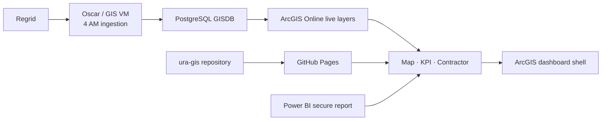

# LandCare Handover

This is the short operating guide for the next GIS analyst and their Codex agent. Start with the [`final readiness checklist`](handover/04-readiness-checklist.md), then use the linked canonical reference for the task at hand.

## Ownership and public surfaces

The repository is owned by the `ura-gis` GitHub organization on `master`.

- Repository: `https://github.com/ura-gis/land-care-assurance`
- Map Monitor: `https://ura-gis.github.io/land-care-assurance/monitoring/`
- KPI Dashboard: `https://ura-gis.github.io/land-care-assurance/kpi/`
- Contractor portal: `https://ura-gis.github.io/land-care-assurance/contractor/`
- Survey submission: `https://ura-gis.github.io/land-care-assurance/survey-submission/`

Do not paste credentials into this file, an issue, or an agent prompt. Use individual accounts with 2FA for GitHub and ArcGIS administration.

## Current architecture

Live ArcGIS sources are authoritative at runtime. Checked-in JSON and GeoJSON are compatibility fallback and finance-contract files. The former 7 AM dashboard refresh is deprecated and excluded from the current operating architecture.

## Daily operations

1. Check the 4 AM upstream Regrid/GISDB task and ArcGIS layer freshness.
2. Open Map Monitor and KPI and reconcile the selected-period completion count.
3. Open one Field Note and confirm its contractor, comment, date, and image.
4. Confirm the secure Power BI Land Care Budget and Parcel Area pages load.
5. Check the Pages workflow after application changes.

If the deprecated 7 AM task still exists on the VM, follow the controlled retirement procedure in [`docs/task-scheduler-vm-operations.md`](docs/task-scheduler-vm-operations.md).

## Safe change workflow

Create a focused branch, update source and canonical documentation together, run the tests, inspect browser surfaces, and open a pull request. Preserve the shared survey adapter and aligned cache-busting versions. Do not change the completion denominator or ArcGIS endpoints without updating [`docs/landcare-metrics-context.md`](docs/landcare-metrics-context.md) and focused tests.

## Ownership and escalation

| Area | Primary owner | Escalate when |
|---|---|---|
| Regrid/GISDB/ArcGIS freshness | GIS/data operations | Period or layer counts are stale or regress |
| GitHub Pages and application code | Web/dashboard owner | Deployment, UI, test, or contract failure |
| Power BI report | Finance/BI owner | Report does not load or governed values change |
| Contractor follow-up | LandCare operations | Open work or evidence gaps concentrate |
| Deprecated 7 AM task retirement | GIS/data operations | Task is still enabled or a remaining consumer is found |

## Canonical references

- [`AGENTS.md`](AGENTS.md) - Codex working rules
- [`handover/04-readiness-checklist.md`](handover/04-readiness-checklist.md) - delivered, pending, and sign-off status
- [`handover/`](handover/) - owner guide, agent playbook, and briefing deck
- [`docs/landcare-architecture.md`](docs/landcare-architecture.md) - current source and runtime architecture
- [`docs/landcare-metrics-context.md`](docs/landcare-metrics-context.md) - metric definitions
- [`docs/task-scheduler-vm-operations.md`](docs/task-scheduler-vm-operations.md) - deprecated task retirement and recovery reference
- [`docs/github-handover-runbook.md`](docs/github-handover-runbook.md) - repository and Pages administration
- [`docs/design-system/README.md`](docs/design-system/README.md) - reusable design system
- [`docs/powerbi-landcare-finance-source.md`](docs/powerbi-landcare-finance-source.md) - Power BI model and optional aggregate extraction
