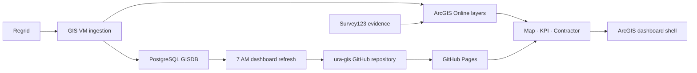

# LandCare Handover

This is the short operating guide for the next GIS analyst and their Codex agent.
Read this page first, then follow the linked runbook for the task at hand.

## Current ownership and public surfaces

The intended post-handover owner is the `ura-gis` GitHub organization. The
repository remains on `master` and the post-cutover Pages base is:

- Repository: `https://github.com/ura-gis/land-care-assurance`
- Map Monitor: `https://ura-gis.github.io/land-care-assurance/monitoring/`
- KPI Dashboard: `https://ura-gis.github.io/land-care-assurance/kpi/`
- Contractor portal: `https://ura-gis.github.io/land-care-assurance/contractor/`
- Survey submission: `https://ura-gis.github.io/land-care-assurance/survey-submission/`

Until the transfer window is complete, the existing `rutomo-ura` URLs remain
the production fallback. Do not paste credentials into this file or into an
issue. Use an individual GitHub account with 2FA and a repository-scoped
automation key for the VM.

## One-minute architecture

Live ArcGIS sources are authoritative at runtime. Checked-in JSON/GeoJSON is
the fallback/cache and finance contract; it is not a replacement for the live
survey or assignment layers.

## Daily operations

1. Check the 4:00 AM upstream Regrid/GISDB task and ArcGIS layer freshness.
2. Check the 7:00 AM `LandCare-Daily-Dashboard-Refresh` task and
   `C:\srv\logs\land-care-assurance\daily-refresh-status.json`.
3. Confirm the Pages workflow succeeded and open Map Monitor/KPI if a refresh
   changed data.
4. For a failed run, read `failed_stage`, fix only that stage, then run the
   checked refresh and validator from
   [`docs/task-scheduler-vm-operations.md`](docs/task-scheduler-vm-operations.md).

## Safe change workflow

Create a branch, update the relevant source and documentation together, run
the tests, inspect the browser surfaces, and open a pull request. Preserve the
shared survey adapter and its cache-busting version when changing survey data
behavior. Do not change the completion denominator or ArcGIS endpoint without
updating [`docs/landcare-metrics-context.md`](docs/landcare-metrics-context.md)
and tests.

## Handover checklist

### Day -5: prepare

- Create the `ura-gis` organization with at least two owners and a
  `landcare-maintainers` team.
- Inventory Pages, environments, Actions secrets/variables, collaborators,
  VM remotes, scheduled tasks, and ArcGIS embeds without copying secret values.
- Prepare the cutover pull request and a repository-scoped VM deploy key.

### Day -1: rehearse

- Run the Python suite, survey-layer tests, Pages validation, and a read-only
  ArcGIS smoke test.
- Have the successor clone the branch and make one harmless documentation
  change through Codex.
- Pause the VM refresh task for the agreed cutover window.

### Cutover day

- Transfer the repository to `ura-gis`, update local/VM remotes, and merge the
  prepared cutover change.
- Deploy Pages, verify all four routes, then update ArcGIS dashboard embeds and
  bookmarks to the new Pages URL.
- Install/test the VM deploy key, run one checked refresh, and resume the task.

### Day +2: sign off

- Confirm two unattended refresh cycles, Pages deployment, morning brief
  dry-run, ArcGIS embed, and current survey/comment rendering.
- Remove the departing account and old VM credentials only after the successor
  signs off.

## Ownership and escalation

| Area | Primary owner | Escalate when |
|---|---|---|
| Regrid/GISDB/ArcGIS freshness | GIS/data operations | Period or layer counts are stale/regress |
| VM refresh and scheduler | GIS/data operations | Status JSON is not `success` |
| Map/KPI/Pages code | Web/dashboard owner | UI, tests, or data contract changes |
| Contractor follow-up | LandCare operations | Open work or evidence gaps concentrate |
| Finance context | Finance owner | Workbook or contract totals change |

## Canonical references

- [`AGENTS.md`](AGENTS.md) - Codex start rules
- [`handover/`](handover/) - owner guide, agent playbook, and briefing deck; start here
- [`docs/landcare-architecture.md`](docs/landcare-architecture.md) - source and runtime architecture
- [`docs/landcare-metrics-context.md`](docs/landcare-metrics-context.md) - metric definitions
- [`docs/task-scheduler-vm-operations.md`](docs/task-scheduler-vm-operations.md) - scheduler/runbook
- [`docs/github-handover-runbook.md`](docs/github-handover-runbook.md) - repository and Pages cutover
- [`docs/vm-smoke-test-regrid-daily-sync.md`](docs/vm-smoke-test-regrid-daily-sync.md) - post-refresh proof
- [`docs/design-system/README.md`](docs/design-system/README.md) - reusable BI design system
