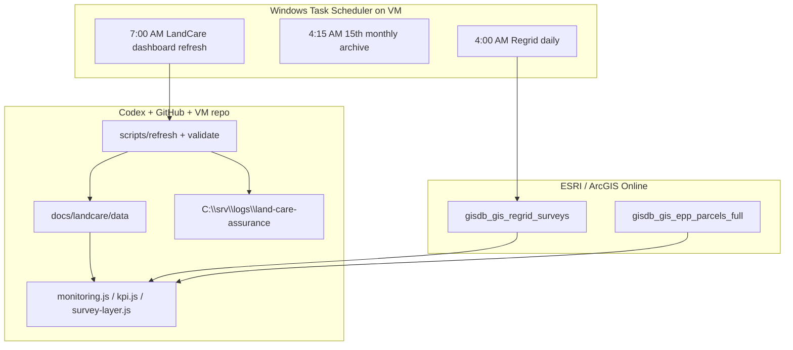
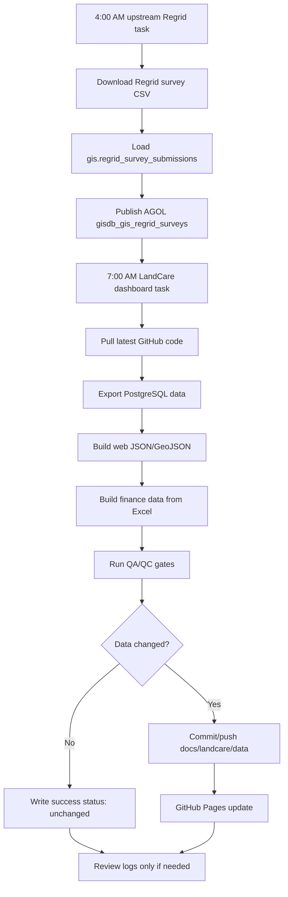
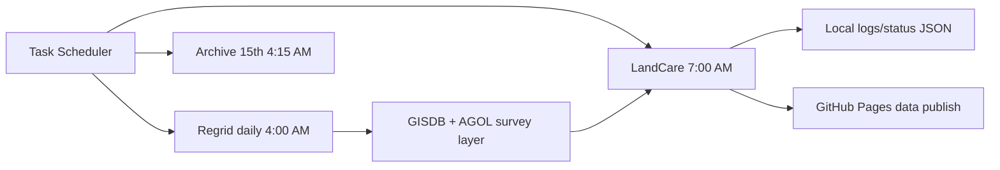
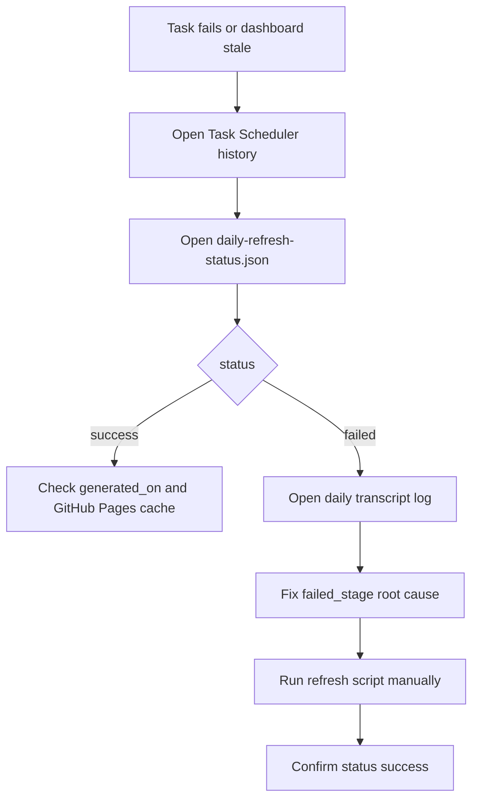
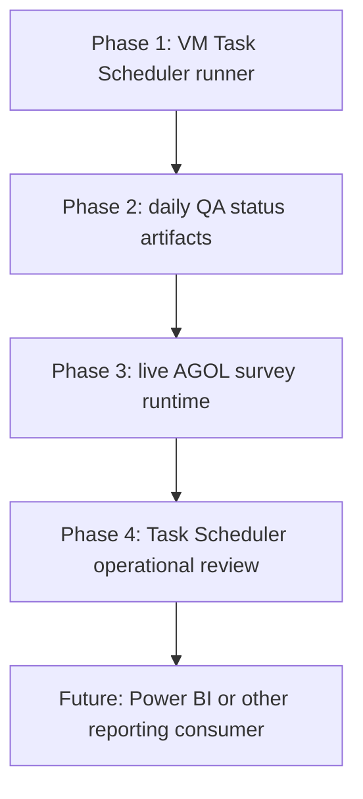

# LandCare Platform Architecture: ESRI, Codex, and Task Scheduler

Last updated: 2026-07-02

Canonical architecture: [`docs/landcare-architecture.md`](../docs/landcare-architecture.md)  
Active VM operations runbook: [`docs/task-scheduler-vm-operations.md`](../docs/task-scheduler-vm-operations.md)

Power Automate is not part of the active operating model. Windows Task Scheduler, VM logs, and status JSON are the control plane.

## Architecture Summary

| Platform | Role | Owns | Does not own |
|---|---|---|---|
| ESRI / ArcGIS | Mapping layer, live parcel universe, daily survey feature layer | Current parcel geography, daily survey submissions, map context, FeatureServer access | Assignment denominator logic, dashboard JSON build, finance metrics |
| Codex + GitHub + VM | Web app builder, data build runner, QA/QC, publish path | Custom web app, source-controlled scripts, daily refresh, generated dashboard files, operational run logs | Regrid login/download, upstream GISDB load |
| Windows Task Scheduler | Orchestration layer on the VM | Daily trigger timing, monthly archive trigger, run history, exit-code visibility | Data transformation logic, metric definitions |
| Local VM logs/status | Monitoring evidence | `daily-refresh-status.json`, dated status JSON, transcript logs | Automated off-VM notification |

## System Context

## Daily Operating Flow

## Task Scheduler Contract

| Task | Folder | Schedule | Command |
|---|---|---|---|
| Regrid daily survey pipeline | `\GIS Automations\REGRID` | Daily 4:00 AM Eastern | `regrid_survey_daily_pipeline.py` from `C:\srv\URA-Data-Repository` |
| Regrid monthly CSV archive | `\GIS Automations\REGRID` | 15th monthly, 4:15 AM Eastern | `regrid_survey_monthly_export.py` |
| LandCare dashboard refresh | `\GIS Automations` | Daily 7:00 AM Eastern | `scripts\refresh_landcare_dashboard.ps1 -RepoRoot C:\srv\GISWebApp\land-care-assurance` |

## Monitoring Contract

Power Automate is not required. Operators check these VM artifacts when Task Scheduler history indicates failure or the dashboard appears stale:

| Artifact | Path | Meaning |
|---|---|---|
| Current status | `C:\srv\logs\land-care-assurance\daily-refresh-status.json` | Latest success/failure result |
| Dated status | `C:\srv\logs\land-care-assurance\daily-refresh-status-YYYY-MM-DD.json` | Historical run record |
| Transcript log | `C:\srv\logs\land-care-assurance\daily-refresh-YYYY-MM-DD.log` | Full run log and failed stage |
| Task history | Windows Task Scheduler UI | Trigger/exit-code confirmation |

## Source Ownership Rules

| Question | Primary source | Reason |
|---|---|---|
| What is the current LandCare parcel universe? | ArcGIS `gisdb_gis_epp_parcels_full` live query | ESRI is the freshest current-state map layer |
| What surveys were returned for a service period? | GISDB `gis.regrid_survey_submissions`, published to AGOL `gisdb_gis_regrid_surveys` | Upstream publishes daily; web app uses AGOL at runtime |
| What parcels were assigned for a reporting month? | PostgreSQL read-only export from `gis.regrid_bundle_assignments` | Bundle assignments define the denominator |
| What does the public dashboard consume for assignments and finance? | `docs/landcare/data` generated files | GitHub-published files are the assignment/finance contract |
| What are current finance, contract, and invoice metrics? | LandCare finance workbook, with optional Postgres parity | Workbook is current finance source |

## Rollout Phases

| Phase | Status | Implementation |
|---|---|---|
| VM Task Scheduler runner | In place | Daily Regrid and LandCare scheduled jobs |
| Daily QA status artifacts | In place | Transcript log and status JSON |
| Live survey layer in web app | In place | `survey-layer.js` queries AGOL daily |
| Task Scheduler operational review | Active model | Review task history/logs as needed |
| Power BI alignment | Future | Use generated dashboard outputs and AGOL parity if approved |
