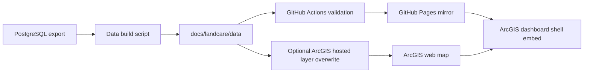

# ArcGIS Online And GitHub CI/CD Decision

Date: June 23, 2026

## Short Answer

Yes, the LandCare monitoring work can use GitHub CI/CD, but not all ArcGIS Online development should be treated the same way.

Recommended path:

- Keep GitHub Pages as the source-controlled public mirror and custom web-app surface.
- Keep ArcGIS Online as the GIS access/front-door layer for URA and contractor users.
- Use GitHub Actions to publish the `docs/` web app and static data artifacts.
- Use a later ArcGIS automation job only for items that truly need to live in ArcGIS Online: hosted feature layer updates, web map JSON updates, dashboard item metadata, sharing, and item cleanup.

This preserves the working model we just validated: ArcGIS Online embeds the full GitHub Pages monitoring/KPI app, so GitHub can own the app release while AGOL gives it an ArcGIS-facing access point.

## Current Repo State

GitHub Pages is currently configured in GitHub as legacy Pages:

- Repository: `rutomo-ura/land-care-assurance`
- Default branch: `master`
- Pages source: `master` branch, `/docs` folder
- Public site: `https://rutomo-ura.github.io/land-care-assurance/`

The repo also has `.github/workflows/pages.yml`. It previously uploaded `prototype/`, which is no longer the correct public app root. It has been updated to upload `docs/` so the workflow matches the current live app structure.

Current public app paths:

- Monitoring: `https://rutomo-ura.github.io/land-care-assurance/monitoring/`
- KPI: `https://rutomo-ura.github.io/land-care-assurance/kpi/`
- ArcGIS shell: `https://urap.maps.arcgis.com/apps/dashboards/341377524e02486ba71684ad67d9b273`

## What Can Be CI/CD

### Good GitHub Actions Targets

- Build or validate the static web app under `docs/`.
- Generate `docs/landcare/data/*.json` and `*.geojson` from a controlled export artifact.
- Validate metric counts before publishing.
- Run JSON schema checks for the app data contract.
- Publish the GitHub Pages mirror.
- Create a release artifact containing the exact data files used for each published app version.

### Good ArcGIS Automation Targets

- Overwrite or append the hosted feature layer when the schema is stable.
- Update item metadata and sharing settings.
- Update web map JSON or dashboard item JSON when configuration changes are source-controlled.
- Clone AGOL content between a lab/dev space and production if URA later wants separate environments.

## What Should Not Be First

Do not make ArcGIS Online the only source of truth for the custom UI. Native ArcGIS dashboards and no-code Experience Builder pages can be hard to review, diff, and promote with normal Git workflows.

Do not rebuild the custom monitoring/KPI app as a native ArcGIS dashboard unless a stakeholder specifically needs native dashboard widgets. The native dashboard attempt was useful, but the full web-app embed is the better current user experience.

## ArcGIS Lab Options

### Option A - Current Recommended Model

GitHub owns the custom app. ArcGIS Online embeds it.

Flow:

1. Developer updates app or data in repo.
2. GitHub Actions validates and publishes `docs/` to GitHub Pages.
3. ArcGIS dashboard shell keeps embedding the same public URL.
4. Optional ArcGIS automation updates hosted layers and item metadata.

Pros:

- Best Git review and CI/CD story.
- Keeps the working app layout.
- Easy to mirror, roll back, and inspect.
- ArcGIS dashboard stays lightweight.

Cons:

- App is public unless access control is added elsewhere.
- AGOL does not own every UI detail; it is the front door, not the source of the app code.

### Option B - ArcGIS Experience Builder Developer Edition

Use Experience Builder Developer Edition when URA needs custom widgets/themes in an ArcGIS-native app that can be downloaded and hosted.

Pros:

- Better fit if the app must become a formal ArcGIS Experience Builder application.
- Can be hosted on a web server after download.
- Custom widgets/themes can live in source control.

Cons:

- Requires Experience Builder Developer Edition setup, Client ID, Node services, and version management.
- Import/export workflow is less straightforward than a normal static web app.
- Adds platform-specific build/deploy complexity.

### Option C - Native ArcGIS Online Dashboard Only

Use native dashboard widgets only.

Pros:

- Familiar AGOL administration.
- Strong fit for simple map, indicator, chart, selector dashboards.

Cons:

- Weakest Git review story.
- Layout and interaction flexibility are limited.
- Recreates functionality already working in the web app.

## Recommended Near-Term CI/CD Architecture

## Proposed GitHub Actions Checks

Add these checks before the Pages deploy step:

- Confirm `docs/monitoring/index.html` exists.
- Confirm `docs/kpi/index.html` exists.
- Confirm `docs/landcare/data/latest_month_summary.json` parses.
- Confirm `latest_month_summary.json` reports `ownership_type = URA` scope or equivalent metadata.
- Confirm latest month, assigned count, returned count, open count, and request-only count are present.
- Confirm `docs/landcare/data/latest_month.geojson` has features.
- Confirm no source data secrets or local database credentials are committed.

## Proposed ArcGIS Automation Later

Add a separate workflow only after credential handling is approved:

- Store ArcGIS credentials as GitHub Actions secrets or use an approved OIDC/service-account pattern if URA supports it.
- Run an ArcGIS Python or REST script.
- Update hosted feature layer item `47eb06a43565442d813189b78d318006`.
- Keep the hosted feature layer item ID stable so web maps and dashboard references do not break.
- Update dashboard/web map metadata with the refresh timestamp.

## Decision

For now, retain GitHub Pages as the mirror and main source-controlled app. Use ArcGIS Online as the public GIS-facing shell. Add ArcGIS automation only for hosted layer and item management once the data-refresh script and credential model are stable.

## Official Reference Notes

- ArcGIS REST `update item` can update an item's metadata, file, URL, or text.
- ArcGIS API for Python supports cloning content such as hosted feature layers and web maps between environments.
- ArcGIS Online supports overwriting hosted feature layers while preserving the layer URL and item properties when schema and source requirements are met.
- Experience Builder Developer Edition apps can be downloaded and hosted on a web server; private content still needs ArcGIS registration/authentication.
- Experience Builder Developer Edition requires a Client ID and local server/client Node services.

