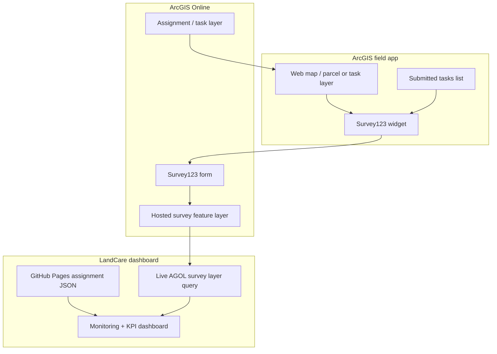

# ArcGIS Survey123 Submission Pattern Reference

Last updated: 2026-07-07

This is a reference dump from peer examples, not an implementation decision. The screenshots reviewed show an Allegheny County-style field workflow using ArcGIS Survey123, Experience Builder, hosted feature layers, and a mobile/tablet-oriented task interface. This may be useful if LandCare eventually wants survey submission inside the ArcGIS ecosystem instead of, or alongside, Regrid submissions.

## Observed Peer Pattern

| Area | Observed pattern | LandCare relevance |
|---|---|---|
| Survey form builder | ArcGIS Survey123 web designer with typed questions such as single-line text, date, dropdown, single select, image/file upload, signature, map, and repeat groups | Could define a controlled LandCare field inspection/submission form without custom frontend form code |
| Submission UI | ArcGIS Experience Builder page embeds a Survey widget/tablet panel | Could create a staff-facing or contractor-facing submission app that opens from a parcel/task selection |
| Map context | Experience Builder includes a web map at top of the mobile layout | Could let users select a parcel, assignment, district, or contractor route before submitting status |
| Task list | Submitted Tasks list/table shows prior submissions with fields such as Name, Date, Task | Could provide operational history, QA review, and follow-up task tracking |
| Feature connection | Survey widget can submit a new record, edit an existing record, or view an existing record; fields can be connected to source-layer attributes | Could prefill parcel ID, contractor, assignment month, park/place name, or task from a selected feature |
| Responsive app layouts | Experience Builder supports separate desktop and mobile/tablet views for the same app | Desktop can support supervisor review and analytics; mobile/tablet can support field submission |
| ArcGIS-native governance | Data lands in hosted feature layers and can be managed in ArcGIS Online | Fits GIS-owned operational workflows and keeps map/submission data close together |

## Screenshot Notes

| Screenshot | What it shows | Key takeaway |
|---|---|---|
| Survey123 Designer | A published Survey123 form named like a landscape task survey, with fields for ID, Park, Name, Type, Date, Initials, Task, Status | Survey123 supports structured task/status capture with required fields and validation |
| Experience Builder Survey Widget | A tablet task window connected to a source layer; widget mode can submit new records, edit selected records, or view selected records | Experience Builder can bridge map/list selection into survey form submission |
| Experience Builder App Layout | Mobile/tablet app with map, type filter, submitted tasks table, and survey access button | The app pattern combines map context, task history, and survey entry in one operational interface |
| Experience Builder Desktop Layout | Desktop layout with table, large map, task edit button, and summary acreage cards | The same app can support office review, QA triage, and summary metrics without forcing the mobile field layout |

## Conceptual Architecture

## Possible LandCare Use Cases

| Use case | How ArcGIS tools could help | Notes |
|---|---|---|
| Contractor field submission | Survey123 form captures parcel, date, contractor, task/status, notes, photos, and initials | Could eventually replace some Regrid submission dependency if contractor workflow accepts ArcGIS |
| Supervisor desktop review | Experience Builder desktop view shows submissions table, large map, task metrics, and edit button | Better for QA review than phone layout; can mirror Allegheny County's desktop/mobile split |
| Internal QA inspection | URA/GIS staff submit QA checks against a parcel or contractor assignment | Useful for exceptions, dispute resolution, and audit trail |
| Correction workflow | Staff edits or adds a follow-up record from an existing selected task | Experience Builder supports edit/view existing record modes |
| Photo evidence | Survey123 image upload stores evidence with the survey feature | Need storage, retention, and privacy rules |
| Assignment-aware prefill | Experience Builder passes selected parcel/task fields into Survey123 | Key fields: parcel ID, assignment period, contractor, task type, district |
| Reviewer dashboard | Submitted tasks list or Experience Builder table gives live review queue | Could support daily operations before data reaches GitHub Pages |

## Comparison With Current Regrid-Based Flow

| Dimension | Current Regrid flow | ArcGIS Survey123 option |
|---|---|---|
| Submission source | Regrid survey export ingested to PostgreSQL and AGOL | Survey123 writes directly to AGOL hosted feature layer |
| Field app | Regrid-controlled experience | URA/GIS-controlled Survey123/Experience Builder app |
| Data model control | Limited by Regrid export schema | Stronger control of fields, required questions, domains, validation, repeats |
| Map integration | Dashboard queries AGOL Regrid survey layer after publish | Submission and review can happen directly inside ArcGIS |
| Offline/mobile | Depends on Regrid capabilities | Survey123 is designed for mobile field collection |
| Adoption risk | Existing contractor habit if Regrid already used | Requires training, accounts/access model, and form governance |
| Dashboard integration | Already implemented using `gisdb_gis_regrid_surveys` | Could be added as another AGOL survey layer or a future replacement source |

## Suggested Experience Builder Layouts

| Layout | Primary user | Recommended components | Purpose |
|---|---|---|---|
| Desktop | URA/GIS supervisor, program manager | Submitted tasks table, large map, filters, summary cards, edit/open Survey123 button | Review completed work, find exceptions, compare geography and task status, edit or open records |
| Tablet/mobile | Field staff, contractor, inspector | Compact map, selected task panel, Survey123 widget, submitted tasks list, back-to-map button | Select parcel/task, submit status, add notes/photos, review nearby prior submissions |

The same hosted feature layer can feed both layouts. The important design choice is to avoid forcing one screen to do both jobs: desktop should be dense and review-oriented, while mobile should be narrow, guided, and submission-oriented.

## Draft Survey Schema Ideas

| Field | Type | Required | Purpose |
|---|---|---:|---|
| `parcel_id` / `parcelnumb` | Text | Yes | Join to assignment and parcel layers |
| `assignment_period` / `period_label` | Text or date-derived value | Yes | Align with dashboard month/service period |
| `contractor` / `maintained_by` | Dropdown | Yes | Contractor accountability |
| `task_type` | Dropdown | Yes | Grass cutting, litter, pruning, snow/ice, vehicle issue, other |
| `status` | Single select | Yes | Complete, partial, needs addressed |
| `inspection_date` | Date | Yes | Submission date |
| `initials` / `submitted_by` | Text | Yes | Audit trail |
| `notes` | Multiline text | No | Field comments |
| `photo` | Image | Optional or conditional | Evidence |
| `geometry` | Map point/polygon or selected parcel geometry | Yes | Spatial review and map display |

## QA/QC Considerations

| Check | Why it matters |
|---|---|
| Required parcel ID and period | Prevents orphan survey records that cannot join to assignments |
| Contractor/domain validation | Avoids spelling drift in KPI grouping |
| One or more submissions per parcel-period policy | Decide whether multiple submissions are allowed or collapsed to latest/best |
| Photo attachment availability | Ensures evidence links do not break in dashboard or reviews |
| Geometry validity | Prevents map display failures |
| Reviewer status | Separates submitted evidence from approved/completed evidence if needed |
| Export parity | If Survey123 is introduced, compare counts against Regrid before switching source-of-truth |

## Open Questions Before Build

| Question | Decision needed |
|---|---|
| Who submits? | Contractors, URA staff, GIS staff, or all of the above |
| Authentication | Public survey, organization-only, named contractor accounts, or shared field accounts |
| Source-of-truth | Keep Regrid primary, use Survey123 for QA only, or plan a migration |
| Feature model | One survey feature per submission, one related table per parcel, or edit assignment/task layer directly |
| Approval workflow | Submitted equals returned, or submitted requires URA review |
| Attachments | Required for some tasks, optional for all, or disabled |
| Dashboard integration | Query Survey123 hosted layer live, mirror into PostgreSQL, or both |

## Recommended Next Step

Do not rebuild the production LandCare submission flow yet. First, create a small ArcGIS prototype:

1. Create a Survey123 form with 8-10 LandCare fields.
2. Connect it to a test hosted feature layer.
3. Build an Experience Builder desktop view for review and a mobile/tablet view for submission.
4. Include a map, selected parcel/task context, submitted tasks table, summary cards, and Survey123 widget.
5. Submit 10-20 test records across two service periods.
6. Compare how easily the dashboard can query that hosted layer versus the current `gisdb_gis_regrid_surveys` layer.

If the prototype works, Survey123 can become an internal QA/correction workflow first, then a contractor-facing submission option later.
