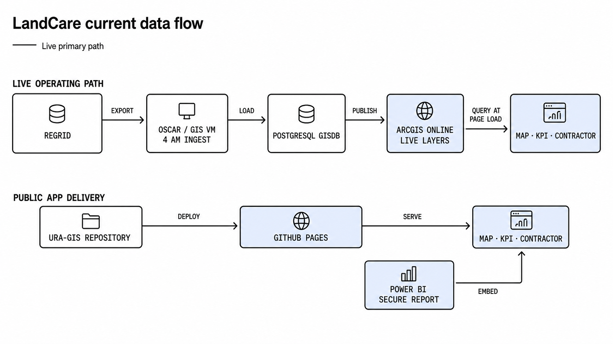
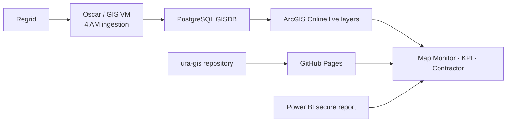

# LandCare Platform Architecture

Last updated: 2026-08-06

This is the canonical source and runtime architecture. For metric rules, see [`landcare-metrics-context.md`](landcare-metrics-context.md). For current delivery status, see [`../handover/04-readiness-checklist.md`](../handover/04-readiness-checklist.md).



## Current production model



| Layer | Owner | Current role |
|---|---|---|
| Ingestion | Oscar/GIS operations in `URA-Data-Repository` | 4 AM Regrid download, GISDB load, and ArcGIS publication; assignment publication follows the upstream bundle process |
| Operational store | PostgreSQL `gisdb` and ArcGIS Online | Survey records, assignment snapshots, parcels, geometry, and comments |
| Application delivery | `ura-gis/land-care-assurance` and GitHub Pages | Static application code and compatibility fallback files |
| Finance and parcel area | Power BI semantic model | Authenticated Land Care Budget and Parcel Area report pages embedded in KPI |

The browser queries ArcGIS at page load. A current map or completion count does not require a repository data commit.

## Active schedule

| Time, Eastern | Process | Output |
|---|---|---|
| 4 AM daily | `regrid_survey_daily_pipeline.py` in the upstream GIS repository | Regrid survey data loaded to GISDB and published to the ArcGIS survey layer |
| Bundle cadence | Upstream assignment publication | Current and historical ArcGIS assignment layers |
| On code change | GitHub Pages workflow | Validated application deployment from `master` |

The former `LandCare-Daily-Dashboard-Refresh.task` at 7 AM is deprecated. It is not part of the current production architecture. Its last identifiable automatic repository commit was July 28, 2026; the checked-in static GIS contract was generated July 29. Retirement instructions are in [`task-scheduler-vm-operations.md`](task-scheduler-vm-operations.md).

## ArcGIS Online sources

| Data | Item | Runtime use |
|---|---|---|
| Survey submissions | [`7a2e1d9bacba461296c54a63f104cf51`](https://urap.maps.arcgis.com/home/item.html?id=7a2e1d9bacba461296c54a63f104cf51) | Survey evidence, photos, `additional_comments`, periods, and completion matching |
| Current assignments | [`0b4733cb5d204da6ab936c9f6d49e401`](https://urap.maps.arcgis.com/home/item.html?id=0b4733cb5d204da6ab936c9f6d49e401) | Current assignment context |
| Assignment history | [`df7d77eb57f14c68b717c2cf3cdaada4`](https://urap.maps.arcgis.com/home/item.html?id=df7d77eb57f14c68b717c2cf3cdaada4) | Selected-period denominator, contractor, and maintenance level |
| EPP parcels | `gisdb_gis_epp_parcels_full` | Current parcel universe and geometry |
| Council districts | `CouncilDistricts2022` | Reference filter and highlight |

Survey service endpoint:

```text
https://services1.arcgis.com/0DMNBNaacQNEfN4H/arcgis/rest/services/regrid_surveys/FeatureServer/0
```

Shared browser adapters:

- [`landcare/survey-layer.js`](landcare/survey-layer.js) normalizes ArcGIS survey data, including `additional_comments` to `additional_notes`.
- [`landcare/assignment-layer.js`](landcare/assignment-layer.js) normalizes current and historical assignment layers.
- [`landcare/monitoring.js`](landcare/monitoring.js), [`landcare/kpi.js`](landcare/kpi.js), and [`landcare/contractor-overview.js`](landcare/contractor-overview.js) consume those adapters.

## Runtime and metric rules

| Question | Authoritative source |
|---|---|
| What was submitted? | Live ArcGIS survey layer, backed by the upstream Regrid/GISDB process |
| What was assigned? | Live ArcGIS assignment current/history layers |
| What is complete? | Raw survey records whose normalized parcel key matches an assignment |
| What is the denominator? | Active assigned records; Request Only is excluded |
| What comments and photos appear? | Live ArcGIS survey fields through the shared survey adapter |
| What provides Land Care Budget and Parcel Area? | Authenticated Power BI report pages |

Unique completed parcels remain diagnostic only. Completion is intentionally not deduplicated.

## GitHub Pages and fallback contract

GitHub Pages serves the four application routes and the design-system example. `docs/landcare/data/` remains checked in for compatibility, historical charts, and finance-contract fallback behavior.

| File group | Purpose now |
|---|---|
| `all_months.geojson`, `latest_month*` | Static compatibility fallback if a live ArcGIS request fails |
| `monthly_metrics.json`, `quarterly_metrics.json`, `contractor_monthly.json` | Historical/fallback chart contract |
| `finance_summary.json` | Checked-in finance compatibility contract; not a live Power BI scrape |
| `refresh_manifest.json` | Date and contents of the static contract; not live ArcGIS freshness |

Do not present the static manifest date as the current survey or assignment date when the live query succeeds.

## Power BI boundary

KPI embeds the authenticated report for Land Care Budget and Parcel Area. The public browser does not receive Power BI credentials or scrape visual values. The optional service-principal extractor in [`scripts/extract_landcare_powerbi_semantic.py`](../scripts/extract_landcare_powerbi_semantic.py) is not an active production dependency. Use it only if a future owner needs governed Power BI aggregates outside the secure report and completes the administrative prerequisites in [`powerbi-landcare-finance-source.md`](powerbi-landcare-finance-source.md).

## Survey123 boundary

Survey123 is a governed optional intake path. It does not replace the current Regrid completion source until its review, canonical parcel reconciliation, public evidence layer, and parallel validation are deployed. See [`landcare-submission-and-evidence-flow.md`](landcare-submission-and-evidence-flow.md).

## Operational ownership

| Platform | Owns |
|---|---|
| Upstream GIS VM and `URA-Data-Repository` | Regrid download, GISDB load, and ArcGIS layer publication |
| PostgreSQL GISDB | Canonical operational survey and assignment records |
| ArcGIS Online | Live public query layers and geometry |
| Power BI | Governed LandCare finance and parcel-area report pages |
| This repository | Browser application, shared adapters, tests, documentation, and static compatibility files |
| GitHub Pages | Public application delivery |

## Current operations references

- [`../handover/04-readiness-checklist.md`](../handover/04-readiness-checklist.md) - delivered and pending work
- [`upstream-regrid-survey-pipeline.md`](upstream-regrid-survey-pipeline.md) - upstream ingestion details
- [`task-scheduler-vm-operations.md`](task-scheduler-vm-operations.md) - deprecated 7 AM task retirement and recovery
- [`vm-smoke-test-regrid-daily-sync.md`](vm-smoke-test-regrid-daily-sync.md) - read-only data verification
- [`design-system/README.md`](design-system/README.md) - reusable application design system
