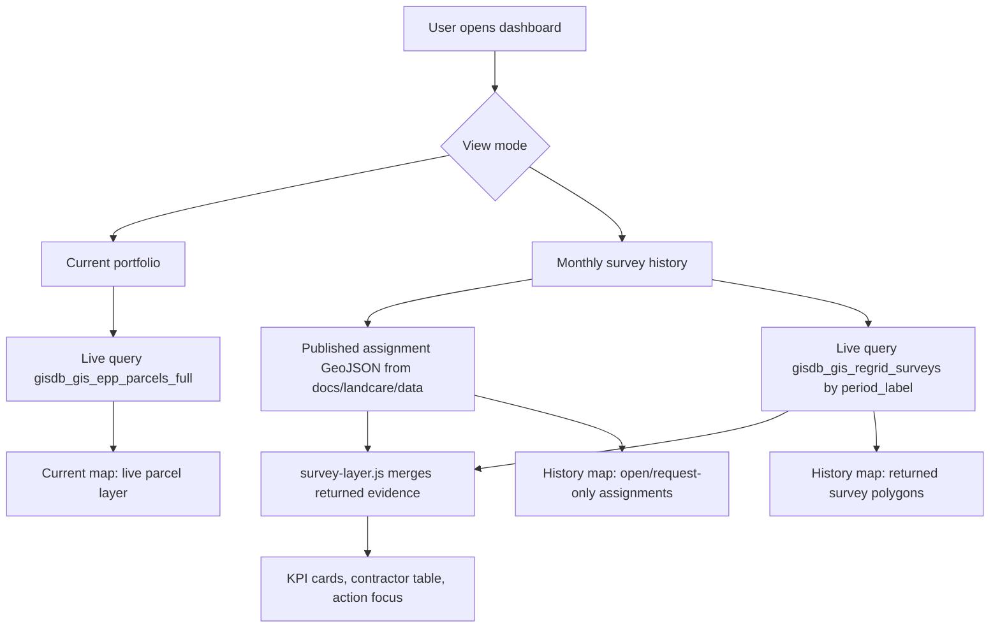

# LandCare Platform Architecture

Last updated: 2026-07-02

This is the canonical architecture reference for the LandCare monitoring platform in this repository. Related docs:

- [`docs/upstream-regrid-survey-pipeline.md`](upstream-regrid-survey-pipeline.md) — upstream Regrid ingestion in `URA-Data-Repository`
- [`docs/task-scheduler-vm-operations.md`](task-scheduler-vm-operations.md) - Task Scheduler VM operations and bundle install flow
- [`data engineering/platform-architecture-esri-codex-power-platform.md`](../data%20engineering/platform-architecture-esri-codex-power-platform.md) - archived ESRI + Codex + Power Platform option; not the current ops path
- [`docs/landcare-data-engineering-flow.md`](landcare-data-engineering-flow.md) — pipeline diagrams and data contract
- [`data engineering/current-data-qaqc-source-inventory.md`](../data%20engineering/current-data-qaqc-source-inventory.md) — source inventory and QA checklist

## System Overview

LandCare assurance data moves through three layers:

| Layer | Location | Role |
|---|---|---|
| Ingestion | `URA-GIS-User/URA-Data-Repository` on GIS VM | Daily Regrid download, GISDB load, AGOL publish; monthly bundle assignments |
| Store | PostgreSQL `gisdb` + ArcGIS Online hosted layers | Survey submissions, bundle assignments, parcel geometry, ownership |
| Publish + app | This repo (`land-care-assurance`) | Daily Postgres export, GitHub Pages JSON/GeoJSON, monitoring map, KPI dashboard |

```mermaid
flowchart TB
    subgraph upstream ["URA-Data-Repository — VM Task Scheduler"]
        Regrid["Regrid web export"]
        DailyPipe["regrid_survey_daily_pipeline.py — 4:00 AM daily"]
        BundlePipe["bundle_assignment_creation.py — monthly 15th"]
        Regrid --> DailyPipe
        BundlePipe --> PGAssign["gis.regrid_bundle_assignments"]
        DailyPipe --> PGSurvey["gis.regrid_survey_submissions"]
        DailyPipe --> AGOLSurvey["AGOL gisdb_gis_regrid_surveys"]
    end

    subgraph store ["Authoritative stores"]
        PGSurvey
        PGAssign
        AGOLSurvey
        AGOLEpp["AGOL gisdb_gis_epp_parcels_full"]
    end

    subgraph downstream ["land-care-assurance — 7:00 AM daily"]
        Export["Postgres read-only export"]
        Build["Build docs/landcare/data"]
        GitPages["GitHub Pages"]
        Export --> Build --> GitPages
    end

    subgraph runtime ["Web app at page load"]
        Monitor["docs/monitoring — map monitor"]
        KPI["docs/kpi — KPI dashboard"]
        SurveyJS["docs/landcare/survey-layer.js"]
        GitPages --> Monitor
        GitPages --> KPI
        AGOLSurvey --> SurveyJS
        SurveyJS --> Monitor
        SurveyJS --> KPI
        AGOLEpp --> Monitor
        AGOLEpp --> KPI
    end

    PGSurvey --> Export
    PGAssign --> Export
```



## Daily Schedule (Eastern)

| Time | Task | Output |
|---|---|---|
| 4:00 AM | `\GIS Automations\REGRID` → `regrid_survey_daily_pipeline.py` | Regrid CSV → `gis.regrid_survey_submissions` → AGOL survey layer |
| 4:15 AM on 15th | `regrid_survey_monthly_export.py` | G-drive CSV archive only |
| 7:00 AM | `\GIS Automations` → `refresh_landcare_dashboard.ps1` | `docs/landcare/data/*` committed/pushed when changed |
| After 7:00 AM | Human/Task Scheduler review when needed | Read `daily-refresh-status.json` and transcript log |

The 7:00 AM job runs after upstream survey load so Postgres export and manifest metadata reflect the latest GISDB state.

## ArcGIS Online Layers

| Layer | Item / service | Cadence | Web app use |
|---|---|---|---|
| Survey submissions | [gisdb_gis_regrid_surveys](https://urap.maps.arcgis.com/home/item.html?id=a4012693d5d74dd8998610c4d235068d) | Daily (upstream publish) | **Primary live source** for returned survey evidence, period list, and history-map survey polygons |
| EPP parcels | `gisdb_gis_epp_parcels_full` | Live | Current URA-owned LandCare universe, geometry alignment, council district filters |
| Council districts | `CouncilDistricts2022` | Reference | District highlight and filter |

Survey layer REST endpoint:

```text
https://services1.arcgis.com/0DMNBNaacQNEfN4H/arcgis/rest/services/gisdb_gis_regrid_surveys/FeatureServer/0
```

## Web App Runtime Model

The GitHub Pages app uses a **hybrid contract**: static published files for assignments and finance, live ArcGIS for surveys and current inventory.



| Data need | Runtime source | Static fallback |
|---|---|---|
| Current URA-owned LandCare parcels | AGOL `gisdb_gis_epp_parcels_full` | Latest month from published GeoJSON |
| Returned survey evidence | AGOL `gisdb_gis_regrid_surveys` via [`docs/landcare/survey-layer.js`](../docs/landcare/survey-layer.js) | Postgres export in published GeoJSON |
| Assignment denominator (org, level, open count) | Published `all_months.geojson` / export JSON | None |
| Finance, contract, invoice metrics | Published `finance_summary.json` | None |
| Available survey months | AGOL `period_label` stats + published manifest | Published manifest only |

Implementation files:

- [`docs/landcare/monitoring.js`](../docs/landcare/monitoring.js) — map monitor; history mode uses live survey FeatureLayer + assignment GeoJSON overlay
- [`docs/landcare/kpi.js`](../docs/landcare/kpi.js) — KPI dashboard; latest-month completion recomputed from live survey layer
- [`docs/landcare/survey-layer.js`](../docs/landcare/survey-layer.js) — shared ArcGIS survey queries and merge helpers

## Published Data Contract (`docs/landcare/data`)

Generated daily by the VM refresh when Postgres or finance inputs change:

| File | Contents | Primary consumer |
|---|---|---|
| `all_months.geojson` | URA-owned assignment rows with geometry | History sidebar metrics; open-assignment map overlay |
| `latest_month*.json` / `.geojson` | Latest comparable month slice | Fallback current view; manifest freshness |
| `monthly_metrics.json` | Completion rates by month | KPI timeline (latest month enriched live in browser) |
| `contractor_monthly.json` | Contractor completion by month | KPI contractor charts |
| `kpi_summary.json` | Summary metadata and latest metrics | KPI header cards |
| `finance_summary.json` | Budget and contract totals | Finance tabs |
| `refresh_manifest.json` | Freshness, counts, survey metadata | QA validation; status JSON upstream block |

Survey **returned** counts for the active service period can change daily in the browser even when these files are unchanged, because the web app queries AGOL at load time.

## Source-of-Truth Rules

| Question | Authoritative source |
|---|---|
| What surveys were submitted for a service period? | GISDB `gis.regrid_survey_submissions`, published daily to AGOL `gisdb_gis_regrid_surveys` |
| What does the web map show for returned surveys? | Live AGOL survey layer (daily refresh from upstream) |
| What parcels were assigned for a reporting month? | GISDB `gis.regrid_bundle_assignments` → published export in this repo |
| What is the current LandCare parcel universe today? | Live AGOL `gisdb_gis_epp_parcels_full` |
| What are finance and contract totals? | LandCare budgeting workbook → `finance_summary.json` |
| What should Power BI consume? | Same published JSON contract; consider mirroring live survey layer for latest-month returned counts |

## Platform Responsibilities

| Platform | Owns | Does not own |
|---|---|---|
| **URA-Data-Repository** | Regrid download, GISDB survey load, AGOL survey publish, bundle CSV generation | GitHub Pages app, dashboard JSON build, Power BI model |
| **PostgreSQL gisdb** | Raw survey rows, bundle assignments, ownership joins | Direct public web access |
| **ArcGIS Online** | Hosted survey and EPP feature layers, map geometry | Assignment denominator logic, finance metrics |
| **This repo + VM** | Daily export, QA, git publish, web app, operational logs | Regrid login, upstream Selenium download |
| **Task Scheduler + VM logs** | Refresh orchestration, run status, failure triage | Core source-of-truth data |

## Monitoring and QA

| Artifact | Path | Purpose |
|---|---|---|
| Daily refresh log | `C:\srv\logs\land-care-assurance\daily-refresh-YYYY-MM-DD.log` | Human troubleshooting |
| Status JSON | `C:\srv\logs\land-care-assurance\daily-refresh-status.json` | Local VM success/failure artifact; optional `upstream` survey metadata |
| QA validator | `scripts/validate_landcare_daily_refresh.py` | Blocks publish on regression or stale manifest |
| VM smoke test | [`docs/vm-smoke-test-regrid-daily-sync.md`](vm-smoke-test-regrid-daily-sync.md) | Post-deploy handoff checklist |
| Task Scheduler runbook | [`docs/task-scheduler-vm-operations.md`](task-scheduler-vm-operations.md) | Install/update, daily flow, and failure triage diagrams |

## Repository Map

```text
land-care-assurance/
├── docs/
│   ├── landcare-architecture.md          ← this document
│   ├── upstream-regrid-survey-pipeline.md
│   ├── landcare-data-engineering-flow.md
│   ├── monitoring/                       ← map monitor app
│   ├── kpi/                              ← KPI dashboard app
│   └── landcare/
│       ├── survey-layer.js               ← live AGOL survey client
│       ├── monitoring.js
│       ├── kpi.js
│       └── data/                         ← published dashboard contract
├── scripts/                              ← VM daily refresh
├── prototype/sql/                        ← Postgres export SQL
├── power-platform/                       <- archived optional build kit, not active ops path
└── data engineering/                     ← QA inventory, platform roles
```


