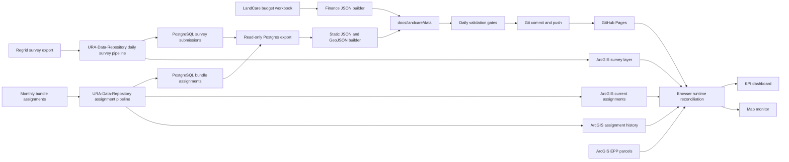

# LandCare Data Engineering and Visualization Logic

Last updated: 2026-07-14

This is the canonical implementation reference for the LandCare Assurance data pipeline, KPI dashboard, map monitor, visualization semantics, automated refresh, and release controls. It documents what the production code does today. Use it with:

- [Platform architecture](landcare-architecture.md)
- [Metric definitions](landcare-metrics-context.md)
- [Data engineering flow](landcare-data-engineering-flow.md)
- [Task Scheduler operations](task-scheduler-vm-operations.md)
- [Current source inventory and QA](../data%20engineering/current-data-qaqc-source-inventory.md)

## 1. Production surfaces

| Surface | URL | Purpose |
|---|---|---|
| KPI dashboard | [GitHub Pages KPI](https://rutomo-ura.github.io/land-care-assurance/kpi/) | Executive metrics, reported completion trend, contractor queue, budget, request history, submission rates, parcel area, parcel details, and expenses |
| Map monitor | [GitHub Pages monitor](https://rutomo-ura.github.io/land-care-assurance/monitoring/) | Current and historical parcel operations, filters, status/contractor rendering, action focus, parcel detail, and print export |
| ArcGIS dashboard shell | [ArcGIS Online dashboard](https://urap.maps.arcgis.com/apps/dashboards/341377524e02486ba71684ad67d9b273) | ArcGIS-hosted sharing surface |
| Source repository | [GitHub repository](https://github.com/rutomo-ura/land-care-assurance) | Application, data contract, automation, QA, and documentation |

## 2. End-to-end operating model



The application uses a hybrid contract:

- Live ArcGIS layers are primary for current inventory, survey evidence, and assignment snapshots at page load.
- Checked-in JSON and GeoJSON provide historical fallback/cache and finance data.
- PostgreSQL remains the authoritative relational store for the scheduled export.
- The finance workbook remains the operational finance source used to build `finance_summary.json`.

## 3. Source-of-truth matrix

| Business question | Primary source | Runtime or fallback behavior |
|---|---|---|
| Which parcels are currently in URA LandCare? | ArcGIS `gisdb_gis_epp_parcels_full` | Browser query filtered to LandCare tags and `inventory_type = 'URA Owned'` |
| Which parcels were assigned in a reporting month? | ArcGIS assignment history backed by `gis.regrid_bundle_assignments` | Live history snapshot first; `all_months.geojson` fallback |
| Which survey records exist for a service period? | ArcGIS `gisdb_gis_regrid_surveys` backed by `gis.regrid_survey_submissions` | Queried live by `period_label`; published GeoJSON is fallback evidence |
| Which assigned parcels count as returned? | Assignment parcel keys inner-matched to survey parcel keys | Recomputed in the browser after normalizing parcel identifiers |
| What are budget and contract values? | LandCare budgeting and contracting workbook | Built daily into `finance_summary.json` |
| What geometry is used? | Pittsburgh parcels first, EPP geometry second | Postgres export coalesces geometry and excludes rows without geometry from GeoJSON |
| What ownership is in scope? | City and assessment ownership records | Published pipeline keeps normalized `URA` ownership only |

### ArcGIS production items

| Layer | Item | Role |
|---|---|---|
| Survey submissions | [Item `a4012693d5d74dd8998610c4d235068d`](https://urap.maps.arcgis.com/home/item.html?id=a4012693d5d74dd8998610c4d235068d) | Live returned-survey evidence and survey polygons |
| Current assignments | [Item `0b4733cb5d204da6ab936c9f6d49e401`](https://urap.maps.arcgis.com/home/item.html?id=0b4733cb5d204da6ab936c9f6d49e401) | Current assignment snapshot and QA context |
| Assignment history | [Item `df7d77eb57f14c68b717c2cf3cdaada4`](https://urap.maps.arcgis.com/home/item.html?id=df7d77eb57f14c68b717c2cf3cdaada4) | Monthly assignment denominator and history |
| Current EPP parcels | `gisdb_gis_epp_parcels_full` FeatureServer | Current URA-owned LandCare universe and geometry |

## 4. Scheduled data engineering flow

### Daily schedule in Eastern Time

| Time | Owner | Process | Result |
|---|---|---|---|
| 4:00 AM | Upstream GIS automation | Download Regrid survey data, load PostgreSQL, publish ArcGIS survey layer | Fresh survey source and live ArcGIS evidence |
| 4:15 AM on the 15th | Upstream GIS automation | Monthly archive export | Closed-period archive only |
| 7:00 AM | LandCare dashboard task | Pull code, export Postgres, build files, validate, commit, push | Refreshed static contract and GitHub Pages release |

The 7:00 AM process is implemented by [`scripts/refresh_landcare_dashboard.ps1`](../scripts/refresh_landcare_dashboard.ps1):

1. Pull `origin/master` with fast-forward-only behavior.
2. Create or reuse the repository virtual environment.
3. Install refresh requirements.
4. Save the previous manifest for regression checks.
5. Run the read-only PostgreSQL export.
6. Build the web JSON/GeoJSON contract.
7. Build finance JSON from the workbook.
8. Run QA/QC validation.
9. Stage only `docs/landcare/data`.
10. Exit successfully without a commit when generated data is unchanged.
11. Commit and push changed data when validation passes.
12. Write current and dated status JSON plus a transcript log.

The task uses retry and timeout controls documented in [Task Scheduler operations](task-scheduler-vm-operations.md).

## 5. PostgreSQL export logic

[`prototype/sql/export_prototype_data_readonly.sql`](../prototype/sql/export_prototype_data_readonly.sql) runs inside a read-only transaction and produces `prototype/source/app_ready_parcels_monthly.geojson`.

### Relational transformation

| SQL stage | Logic |
|---|---|
| `latest_dates` | Finds latest assignment and survey dates and the latest comparable survey month |
| `survey_stats` | Counts raw survey submissions and distinct normalized survey parcels for the latest survey period |
| `current_epp` | Keeps the latest EPP record per normalized parcel key and derives Active/Request Only from tags |
| `assignments` | Deduplicates to one row per parcel-month; uses assignment organization and maintenance level with EPP fallback |
| `returned` | Deduplicates survey evidence to normalized parcel-month keys |
| `parcel_geometry` | Prefers Pittsburgh parcel geometry and falls back to EPP geometry |
| `owner_lookup` | Combines city and assessment ownership and normalizes owner text |
| `parcel_month` | Joins assignment, survey evidence, geometry, and ownership; derives return and completion status |
| `feature_rows` | Builds simplified GeoJSON features with six-decimal coordinates |

### Identity normalization

Parcel identifiers are normalized by removing every non-numeric character. This is the common join key across assignment, survey, EPP, parcel geometry, city ownership, and assessment data.

The export deduplicates assignments by `(period_month, parcel_key)`. This is critical: counts are parcel counts, not source-row counts.

### Status derivation

```text
request_only = maintenance_level is Request Only
returned     = maintenance_level is Active and a survey parcel-month match exists
missing      = all other assigned parcels
```

`Request Only` parcels are retained for inventory context but excluded from the primary completion denominator.

### Ownership classification

Owner names are lowercased, stripped to alphanumeric text, and classified using normalized variants:

- Pittsburgh Land Bank
- URA / Urban Redevelopment Authority
- City of Pittsburgh
- Other or unknown

The downstream web-data builder publishes only features where `ownership_type == "URA"`.

## 6. Static published data contract

[`scripts/build_landcare_web_data.py`](../scripts/build_landcare_web_data.py) converts the app-ready export into `docs/landcare/data`.

| File | Grain | Main fields | Consumer |
|---|---|---|---|
| `all_months.geojson` | Parcel-month | parcel, period, organization, level, ownership, return status, geometry | History map and fallback aggregation |
| `latest_month.geojson` | Parcel for latest comparable month | Same feature contract | Current fallback |
| `latest_month_summary.json` | One summary | counts by status, contractor, level, ownership | Monitoring summary and QA |
| `monthly_metrics.json` | Month | assigned active/total, returned assigned, active/blended rates, raw survey rows | KPI trend and submission table |
| `contractor_monthly.json` | Month-contractor | assigned, returned, completion rate | Contractor queue and detail |
| `kpi_summary.json` | One summary | freshness, available months, latest KPI values, source contract | KPI context and fallback |
| `finance_summary.json` | Summary plus contractor/history rows | contract, invoice, acreage, cost intensity, request history | Budget, request, and expense tabs |
| `refresh_manifest.json` | One run | generation date, period dates, counts, file scope | QA and run-status context |

### Static metric aggregation

For each month, the builder maintains distinct parcel-key sets:

```text
assigned_active        = distinct Active assignment parcel keys
assigned_total         = distinct all assignment parcel keys
returned_assigned      = distinct Active parcel keys with returned evidence
active_completion_pct  = returned_assigned / assigned_active * 100
blended_completion_pct = returned_assigned / assigned_total * 100
survey_rows_raw        = distinct returned parcel keys in the export
```

Contractor rows are aggregated only for Active assignments. Each contractor-month rate is returned distinct parcel keys divided by assigned distinct parcel keys.

## 7. Finance engineering logic

[`scripts/build_landcare_finance_data.py`](../scripts/build_landcare_finance_data.py) reads the network workbook `Land Care Annual Budgeting and Contracting.xlsx`.

| Workbook area | Output |
|---|---|
| `2025 - 2027 Cycle` | Current contracts and summary totals |
| `Sheet1` | Check request history |

Derived values:

```text
acres                    = square footage / 43,560
annual invoice run rate  = monthly invoice amount * 12
monthly cost per parcel  = monthly invoice amount / parcels
annual cost per acre     = annual invoice run rate / acres
```

Finance parcel totals describe contract scope. They are not interchangeable with the live EPP inventory or a monthly assignment denominator.

## 8. Browser runtime reconciliation

The browser merges fresh ArcGIS data with the published contract every time the application loads.

### Shared survey client

[`docs/landcare/survey-layer.js`](landcare/survey-layer.js):

- Queries survey layer metadata and period statistics.
- Pages through ArcGIS query results.
- Normalizes survey parcel identifiers.
- Loads evidence by period.
- Marks assignment features returned when normalized parcel keys match.
- Enriches summary and latest-month metrics with live survey freshness/counts.

### Shared assignment client

[`docs/landcare/assignment-layer.js`](landcare/assignment-layer.js):

- Queries current and historical assignment FeatureServers.
- Converts Esri polygon rings to GeoJSON.
- Normalizes parcel keys, contractor names, and maintenance levels.
- Produces live GeoJSON used by both application surfaces.
- Falls back to checked-in assignment GeoJSON if the history request fails.

### Live current inventory

Both application surfaces query `gisdb_gis_epp_parcels_full` using:

```text
tags LIKE '%LandCare%' AND inventory_type = 'URA Owned'
```

The current dataset derives maintenance level from EPP tags, normalizes contractor names, and calculates acreage from parcel acreage or square footage.

## 9. KPI dashboard business logic

Primary implementation: [`docs/landcare/kpi.js`](landcare/kpi.js).

### Load and aggregation sequence

1. Load published monthly, contractor, KPI, finance, and GeoJSON files.
2. Query live current EPP records.
3. Query survey period statistics and layer metadata.
4. Query current and historical assignment metadata and history features.
5. Load survey evidence for available months.
6. Merge survey evidence into assignment features.
7. Aggregate live monthly and contractor metrics when live assignment history succeeds.
8. Use published aggregation only when live assignment history is unavailable.
9. Select the latest available month and render all views.

### Overview cards

| Card | Value | Interpretation |
|---|---|---|
| Completion | Active returned / Active assigned | Primary operational rate for the selected month |
| Open Queue | Sum of `max(assigned - returned, 0)` | Remaining Active assignment workload |
| LandCare Inventory | Distinct live current EPP parcels | Current universe, with active parcel count as context |
| Budget Run Rate | Annualized monthly invoices | Finance workload context; rounded to whole dollars on the executive card |

When a selected month contains no survey records, the dashboard does not present zero as a performance result. It shows `Awaiting submissions`, renders an em dash in the gauge, and excludes that month from the reported trend and trend average.

### Reported completion trend

- Includes only months where `survey_rows_raw > 0`.
- Uses Active completion percent on a fixed 0-100% scale.
- Draws an 80% reference target.
- Shows month, rate, delta, and returned/assigned count in accessible point tooltips.
- Calculates the average across reported months only.
- Labels a pending selected month instead of plotting a false zero.

### Contractor queue

- Sorts by open count descending, then lower completion rate.
- Shows the top five contractors for the all-contractor executive view.
- Preserves the full contractor list in the filter.
- Uses stacked returned/open bars scaled to the largest assignment total in the displayed set.
- Shows returned/assigned count and completion percent in each row.

### KPI report tabs

| Tab | Visual and calculation logic |
|---|---|
| Overview | Four executive cards, reported completion trend, top-five contractor queue |
| Budget | Annual run rate, monthly invoice total, total contract amount, contractor count, and contractor amount bars |
| Requests | Check request history from the workbook history sheet |
| Submission Rate | Monthly Active and blended completion values from the reconciled monthly metrics |
| Parcel Area | Current EPP acreage aggregated by contractor |
| Parcels | Contractor detail combining current parcel/acres data with selected-month returned/assigned values |
| Expenses | Annual cost per acre, monthly cost per parcel, contract acreage/parcels, contractor intensity bars, and expense detail |

The report navigation uses tab semantics and synchronizes `aria-selected`, `aria-hidden`, and tab-panel labels.

## 10. Map monitor visualization logic

Primary implementation: [`docs/landcare/monitoring.js`](landcare/monitoring.js).

### Data modes

| Mode | Main layer | Purpose |
|---|---|---|
| Current | Live EPP FeatureLayer | Current URA-owned LandCare inventory and operational ownership |
| History | Live assignment GeoJSON plus live survey FeatureLayer | Selected service-month assignment, survey coverage, and completion reconciliation |

### Visual encodings

- Status mode colors parcels by returned, missing/open, or Request Only.
- Contractor mode uses a stable contractor color lookup.
- Live surveys use a separate survey renderer so submitted evidence is distinguishable from assignment status.
- Council district and neighborhood layers provide geographic context without becoming metric denominators.
- The light basemap uses CARTO/OSM attribution.

### Filters and interaction

- Month selects a reporting period.
- Contractor filters assignment and current layers using normalized organization logic.
- LandCare status filters returned/missing/Request Only states.
- Council district applies geometry context and map highlighting.
- Color mode changes renderer without changing the underlying denominator.
- Filter changes update KPIs, contractor performance, legend, action focus, freshness, and map extent together.
- Parcel selection opens a normalized parcel detail view.

### Action focus

The action panel ranks operational attention using open assignments and contractor performance. It is a triage aid, not a separate source-of-truth metric.

### Print/PDF export

The map export flow:

1. Resolves the active filter extent.
2. Waits for map rendering to stabilize.
3. Captures the map image.
4. Builds a print layout with selected statistics and legend.
5. Opens the browser print workflow for PDF output.

## 11. Freshness and status semantics

The dashboard intentionally separates these concepts:

| Signal | Meaning |
|---|---|
| `generated_on` | Date the static repository contract was built |
| Survey layer edit date | Latest ArcGIS survey-layer modification metadata |
| Latest assignment period | Most recent assignment period available |
| Latest survey period | Most recent service period with survey source data |
| Data Status: Reported | The selected month contains survey records |
| Data Status: Awaiting submissions | No survey records exist yet for the selected month |

An available assignment month can be newer than the latest reported survey month. That is expected and must not be interpreted as zero completion.

## 12. QA and publication gates

[`scripts/validate_landcare_daily_refresh.py`](../scripts/validate_landcare_daily_refresh.py) blocks publication when core contracts fail.

| Gate | Failure condition |
|---|---|
| Required files | A required JSON/GeoJSON file is missing or malformed |
| Generation date | Manifest or finance generation date is not the expected run date |
| Source schema | App-ready GeoJSON lacks required parcel, period, organization, level, or status properties |
| Duplicate grain | More than one feature exists for the same parcel-month |
| Count integrity | GeoJSON counts do not match the manifest |
| Status integrity | Latest status counts do not sum to latest feature count |
| Date regression | Assignment or survey period moves backward |
| Same-period count regression | Survey or returned counts decrease within the same period |
| Geometry regression | Missing geometry rises beyond the configured allowance |
| Finance integrity | Contractor count, parcel count, or annual run rate is non-positive |
| Freshness warning | Survey period exceeds the allowed stale-day threshold |

The browser surfaces also fail visibly when source loading fails. A successful release requires static checks plus live-page verification after deployment.

## 13. Automation artifacts and failure recovery

| Artifact | Default location | Purpose |
|---|---|---|
| Daily transcript | `C:\srv\logs\land-care-assurance\daily-refresh-YYYY-MM-DD.log` | Full stage-by-stage troubleshooting |
| Current status | `C:\srv\logs\land-care-assurance\daily-refresh-status.json` | Machine-readable latest result |
| Dated status | `C:\srv\logs\land-care-assurance\daily-refresh-status-YYYY-MM-DD.json` | Durable run history |
| Scheduled-task proof | Written by `scripts/test_landcare_scheduled_refresh.ps1` | Verifies exit code and same-day status evidence |

Failure triage order:

1. Check Task Scheduler result and the transcript log.
2. Identify the failed stage: pull, database export, web build, finance build, QA, commit, or push.
3. Correct credentials, source availability, schema drift, or Git access without bypassing validation.
4. Run the refresh manually.
5. Confirm `status: success` and a current run date.
6. Run the scheduled-task proof command when task configuration changed.

## 14. Security and operational boundaries

- Database and service-account credentials stay in the VM-local `.env` or Windows Task Scheduler credential store.
- Credentials, tokens, and passwords must never be committed.
- The database export is read-only and ends with `rollback`.
- Git publication is limited to generated dashboard data during the scheduled refresh.
- Live public pages consume only the fields exposed by the published data contract and ArcGIS services.
- Ownership filtering is an inclusion rule for URA scope, not an authorization mechanism.

## 15. Change-impact checklist

When changing a source field, join rule, metric, or visual:

1. Update the SQL export or browser normalizer.
2. Update the static builder if the published contract changes.
3. Update validation for the new invariant.
4. Update both KPI and monitoring consumers when they share the metric.
5. Verify reported and pending-month states.
6. Verify current and historical map modes.
7. Check desktop and compact layouts.
8. Run JavaScript syntax checks and Python validation.
9. Confirm GitHub Pages deploys the same HTML, CSS, JS, and data versions.
10. Update this document and the metric glossary.

## 16. Code ownership map

| Concern | Implementation |
|---|---|
| Read-only relational export | `prototype/sql/export_prototype_data_readonly.sql` |
| Postgres execution wrapper | `scripts/export_landcare_postgres_data.py` |
| Static web contract | `scripts/build_landcare_web_data.py` |
| Finance contract | `scripts/build_landcare_finance_data.py` |
| QA gates | `scripts/validate_landcare_daily_refresh.py` |
| Scheduled orchestration | `scripts/refresh_landcare_dashboard.ps1` |
| Task registration | `scripts/register_landcare_daily_refresh_task.ps1` |
| Scheduled proof | `scripts/test_landcare_scheduled_refresh.ps1` |
| Survey runtime client | `docs/landcare/survey-layer.js` |
| Assignment runtime client | `docs/landcare/assignment-layer.js` |
| KPI visualizations | `docs/landcare/kpi.js` and `docs/kpi/index.html` |
| Map visualization | `docs/landcare/monitoring.js` and `docs/monitoring/index.html` |
| Shared visual system | `docs/landcare/app.css` |
