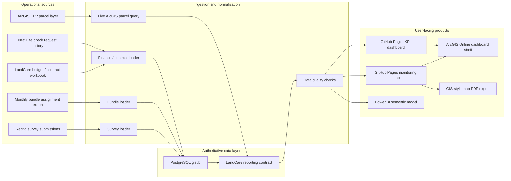
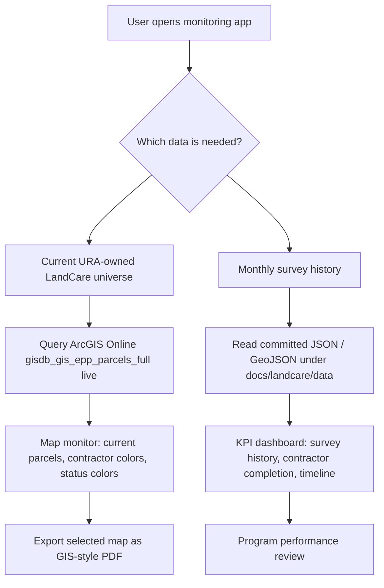
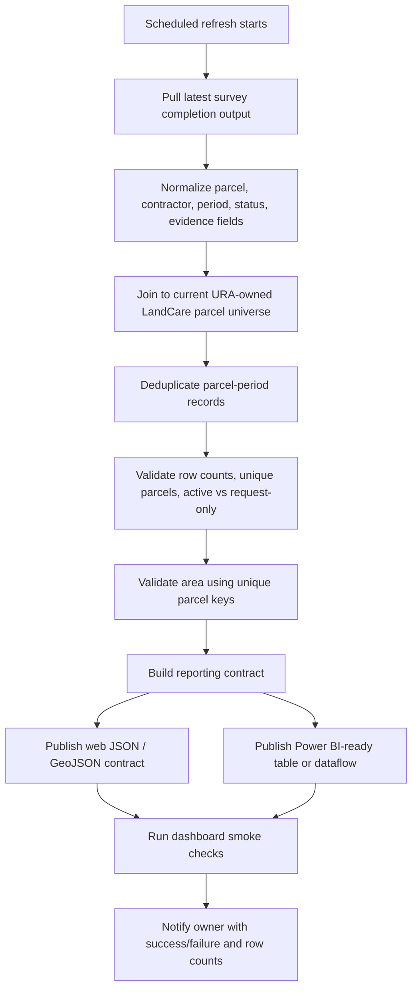
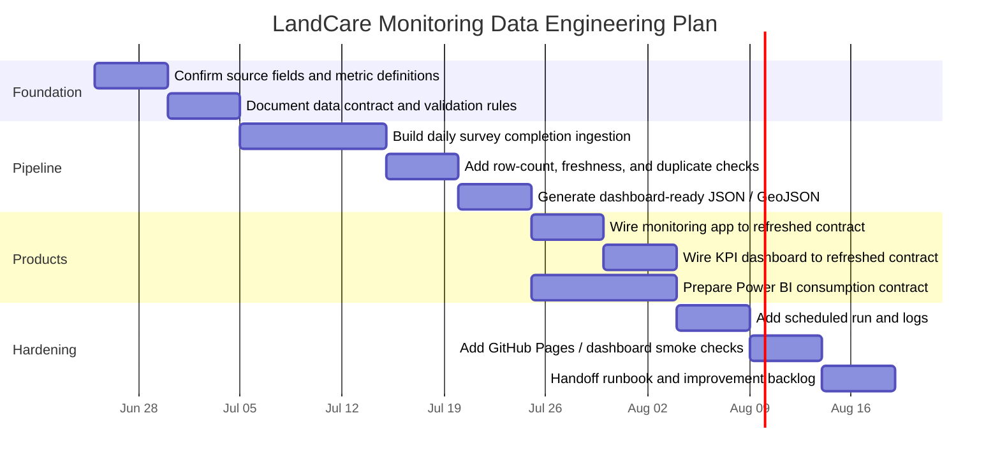

# LandCare Data Engineering Flow

This note is the quick visual reference for the LandCare monitoring data pipeline. It complements the longer implementation plan in `docs/landcare-production-data-engineering-plan.md`.

## Operating Architecture

## Current Production Behavior

## Target Daily Refresh Plan

## Two-Month Delivery Plan

## Data Contract Checklist

- `parcel_key`: normalized parcel identifier used across ArcGIS, Regrid, PostgreSQL, web, and Power BI.
- `period_month`: reporting month for assignment and completion status.
- `organization`: contractor name normalized without contact suffixes.
- `maintenance_level`: `Active`, `Request Only`, or explicit exception value.
- `completion_status`: `returned`, `missing`, `request_only`, or current-active status.
- `returned_flag`: boolean for survey completion.
- `ownership_type`: URA/PLB/other classification used for metric scope.
- `council_district`, `neighborhood`, `geometry`: spatial context for map filters and export.
- `area_acres`: unique-parcel area using the selected authoritative ArcGIS field.
- `source_updated_at`: freshness timestamp for each source adapter.

## Near-Term Decisions

- Decide whether Power BI should read the web JSON contract, a PostgreSQL view, or a Power BI dataflow built from the same contract.
- Decide whether ArcGIS Online needs a hosted monthly assurance layer or should continue embedding the GitHub Pages app while querying existing hosted layers.
- Decide whether Regrid remains a temporary source adapter or gets replaced later by ArcGIS Survey123, Field Maps, or a custom survey form.
- Decide the alert owner for failed refreshes, stale survey periods, and count drift.
