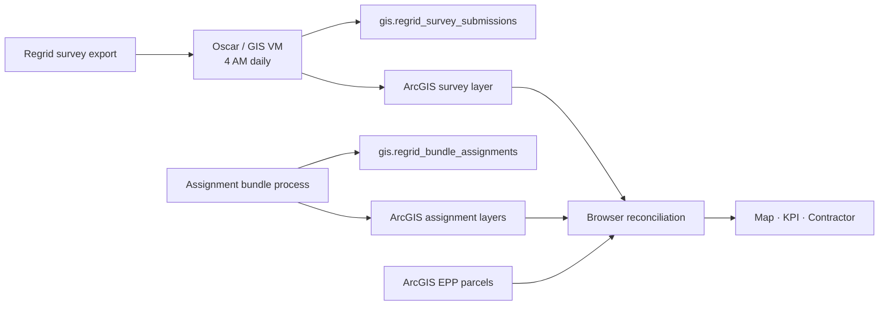
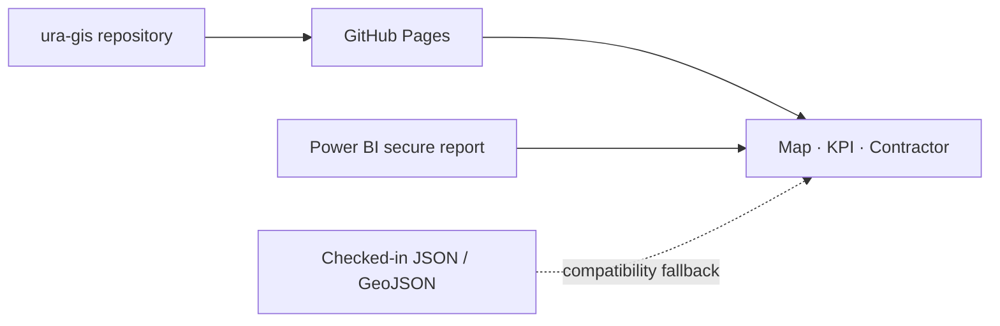

# LandCare Data Engineering Flow

Last updated: 2026-08-06

This is the quick technical view of the current pipeline. [`landcare-architecture.md`](landcare-architecture.md) is canonical, and [`landcare-metrics-context.md`](landcare-metrics-context.md) defines the calculations.

## Live data flow

```mermaid
flowchart LR
    Regrid["Regrid survey export"] --> Daily["Oscar / GIS VM<br/>4 AM daily"]
    Daily --> PGSurvey["gis.regrid_survey_submissions"]
    Daily --> SurveyLayer["ArcGIS survey layer"]
    Bundle["Assignment bundle process"] --> PGAssign["gis.regrid_bundle_assignments"]
    Bundle --> AssignLayers["ArcGIS assignment layers"]
    SurveyLayer --> Browser["Browser reconciliation"]
    AssignLayers --> Browser
    EPP["ArcGIS EPP parcels"] --> Browser
    Browser --> App["Map · KPI · Contractor"]
```

The web application reads live ArcGIS survey and assignment layers at page load. The selected-period completion numerator is raw survey records matched to assignment parcel keys. The denominator is Active assignments; Request Only is excluded.

## Application delivery

```mermaid
flowchart LR
    Repo["ura-gis repository"] --> Pages["GitHub Pages"]
    Pages --> App["Map · KPI · Contractor"]
    PowerBI["Power BI secure report"] --> App
    Static["Checked-in JSON / GeoJSON"] -. compatibility fallback .-> App
```

Land Care Budget and Parcel Area are authenticated Power BI embeds. Static JSON and GeoJSON remain compatibility files and must not be used as a freshness source when ArcGIS is available.

## Upstream responsibilities

| Component | Responsibility |
|---|---|
| `regrid_survey_daily_pipeline.py` | Download current Regrid survey output, load GISDB, and publish the ArcGIS survey layer |
| `gis.regrid_survey_submissions` | Canonical submitted survey rows |
| ArcGIS item `7a2e1d9bacba461296c54a63f104cf51` | Public all-period survey evidence, comments, photos, and period fields |
| Current assignment item `0b4733cb5d204da6ab936c9f6d49e401` | Current assignment context |
| History assignment item `df7d77eb57f14c68b717c2cf3cdaada4` | Selected-period assignment denominator |
| Monthly archive export | Archive only; not the dashboard freshness source |

## Deprecated 7 AM process

The former `LandCare-Daily-Dashboard-Refresh.task` ran [`refresh_landcare_dashboard.ps1`](../scripts/refresh_landcare_dashboard.ps1) to export PostgreSQL data, rebuild `docs/landcare/data/`, validate it, and push changed files. It also contained optional Power BI and Survey123 stages.

This process is deprecated and excluded from the current production architecture. Repository history shows its last identifiable automatic commit on July 28, 2026. The static GIS contract was generated July 29, while live ArcGIS contains newer records.

The scripts are retained only for recovery and audit. Follow [`task-scheduler-vm-operations.md`](task-scheduler-vm-operations.md) to archive and disable the VM task. Reactivation requires a named consumer, current credentials owned by an organization account, updated tests, and a checked deployment.

## Data contract

| Field or measure | Live source | Compatibility fallback |
|---|---|---|
| `parcel_key` | Normalized ArcGIS survey and assignment values | `all_months.geojson` |
| `period_label` | ArcGIS survey and assignment layers | `refresh_manifest.json` |
| Contractor and maintenance level | ArcGIS assignment layers | Published GeoJSON |
| Completion | Browser join of live survey and assignment records | Published historical metrics |
| Comments and photos | ArcGIS survey layer | Published evidence fields when present |
| Budget and parcel area | Secure Power BI report | `finance_summary.json` compatibility contract |

## Verification

1. Check the latest edit timestamp and period statistics on the three ArcGIS layers.
2. Query one known parcel and confirm contractor, period, comment, and image behavior.
3. Reconcile Map Monitor and KPI completion for the same selected period.
4. Open both secure Power BI report pages.
5. Confirm GitHub Pages succeeded after code changes.

Related references:

- [`upstream-regrid-survey-pipeline.md`](upstream-regrid-survey-pipeline.md)
- [`vm-smoke-test-regrid-daily-sync.md`](vm-smoke-test-regrid-daily-sync.md)
- [`../handover/04-readiness-checklist.md`](../handover/04-readiness-checklist.md)
