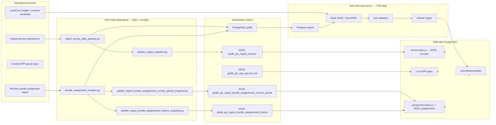
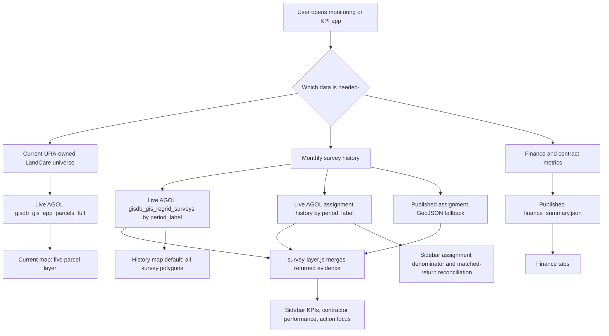
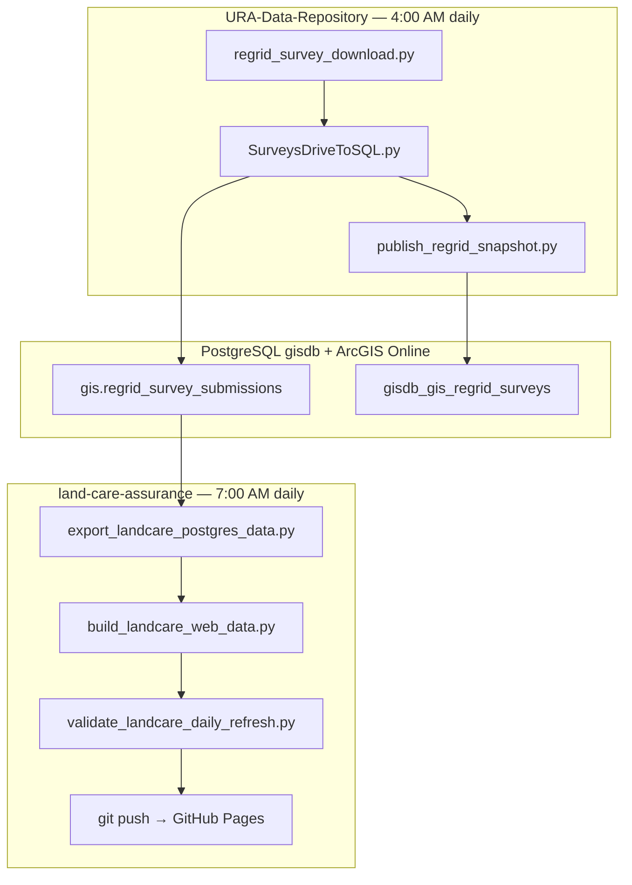
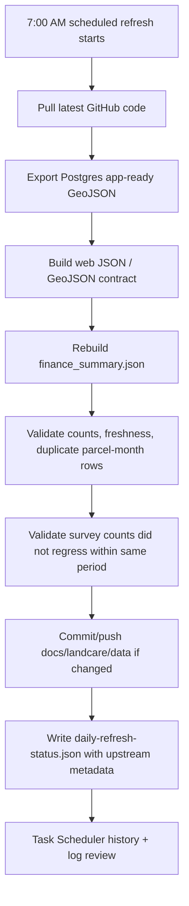

# LandCare Data Engineering Flow

This note is the quick visual reference for the LandCare monitoring data pipeline. See [`docs/landcare-architecture.md`](landcare-architecture.md) for the full platform architecture and [`docs/landcare-metrics-context.md`](landcare-metrics-context.md) for metric definitions.

For the contractor Survey123 path, approval gate, and evidence-photo contract, see [`docs/landcare-submission-and-evidence-flow.md`](landcare-submission-and-evidence-flow.md). That flow is intentionally separate from the official Regrid completion calculation.

## End-to-End Architecture

```mermaid
flowchart LR
    subgraph Sources["Operational sources"]
        Regrid["Regrid survey submissions"]
        BundleExport["Monthly bundle assignment export"]
        EPP["ArcGIS EPP parcel layer"]
        Budget["LandCare budget / contract workbook"]
    end

    subgraph Upstream["URA-Data-Repository — daily + monthly"]
        SurveyPipe["regrid_survey_daily_pipeline.py"]
        BundlePipe["bundle_assignment_creation.py"]
        AgolPub["publish_regrid_snapshot.py"]
        AssignCurrentPub["publish_regrid_bundle_assignments_current_period_snapshot.py"]
        AssignHistoryPub["publish_regrid_bundle_assignments_history_snapshot.py"]
    end

    subgraph Store["Authoritative stores"]
        PG["PostgreSQL gisdb"]
        AGOLSurvey["AGOL gisdb_gis_regrid_surveys"]
        AGOLAssignCurrent["AGOL gisdb_gis_regrid_bundle_assignments_current_period"]
        AGOLAssignHistory["AGOL gisdb_gis_regrid_bundle_assignments_history"]
        AGOLEpp["AGOL gisdb_gis_epp_parcels_full"]
    end

    subgraph Publish["land-care-assurance — 7 AM daily"]
        Export["Postgres export"]
        Build["Build JSON / GeoJSON"]
        Validate["QA validation"]
        GitHub["GitHub Pages"]
    end

    subgraph Runtime["Web app at page load"]
        SurveyLive["survey-layer.js → AGOL surveys"]
        AssignLive["assignment-layer.js -> AGOL assignments"]
        EppLive["Live EPP query"]
        StaticJSON["docs/landcare/data"]
    end

    Regrid --> SurveyPipe
    BundleExport --> BundlePipe
    SurveyPipe --> PG
    SurveyPipe --> AgolPub
    AgolPub --> AGOLSurvey
    BundlePipe --> PG
    BundlePipe --> AssignCurrentPub
    BundlePipe --> AssignHistoryPub
    AssignCurrentPub --> AGOLAssignCurrent
    AssignHistoryPub --> AGOLAssignHistory
    Budget --> Build

    PG --> Export --> Build --> Validate --> GitHub
    GitHub --> StaticJSON
    AGOLSurvey --> SurveyLive
    AGOLAssignCurrent --> AssignLive
    AGOLAssignHistory --> AssignLive
    AGOLEpp --> EppLive
    StaticJSON --> Runtime
    SurveyLive --> Runtime
    EppLive --> Runtime
    AssignLive --> Runtime
```

## Current Production Behavior

```mermaid
flowchart TD
    A["User opens monitoring or KPI app"] --> B{"Which data is needed-"}

    B --> C["Current URA-owned LandCare universe"]
    B --> D["Monthly survey history"]
    B --> E["Finance and contract metrics"]

    C --> F["Live AGOL gisdb_gis_epp_parcels_full"]
    D --> G["Live AGOL gisdb_gis_regrid_surveys by period_label"]
    D --> H["Live AGOL assignment history by period_label"]
    D --> H2["Published assignment GeoJSON fallback"]
    E --> I["Published finance_summary.json"]

    G --> J["survey-layer.js merges returned evidence"]
    H --> J
    H2 --> J
    J --> K["Sidebar KPIs, contractor performance, action focus"]
    G --> L["History map default: all survey polygons"]
    H --> M["Sidebar assignment denominator and matched-return reconciliation"]
    F --> N["Current map: live parcel layer"]
    I --> O["Finance tabs"]
```

## Daily Production Schedule

```mermaid
flowchart TD
    subgraph upstream ["URA-Data-Repository — 4:00 AM daily"]
        RegridDL["regrid_survey_download.py"]
        SurveyLoad["SurveysDriveToSQL.py"]
        AgolPub["publish_regrid_snapshot.py"]
        RegridDL --> SurveyLoad --> AgolPub
    end

    subgraph gisdb ["PostgreSQL gisdb + ArcGIS Online"]
        SurveyTable["gis.regrid_survey_submissions"]
        SurveyLayer["gisdb_gis_regrid_surveys"]
        SurveyLoad --> SurveyTable
        AgolPub --> SurveyLayer
    end

    subgraph downstream ["land-care-assurance — 7:00 AM daily"]
        Export["export_landcare_postgres_data.py"]
        Build["build_landcare_web_data.py"]
        Validate["validate_landcare_daily_refresh.py"]
        Publish["git push → GitHub Pages"]
        Export --> Build --> Validate --> Publish
    end

    SurveyTable --> Export
```

Upstream details: [`docs/upstream-regrid-survey-pipeline.md`](upstream-regrid-survey-pipeline.md).

## Upstream Regrid Flow Assessment

The upstream `URA-GIS-User/URA-Data-Repository` repo now treats Regrid survey submissions as a database-first daily pipeline. The relevant upstream commit line observed locally is `c59ec89 Merge Regrid survey pipeline updates`.

| Area | Current upstream behavior | LandCare dashboard implication |
|---|---|---|
| Daily survey ingestion | `regrid_survey_daily_pipeline.py` runs `regrid_survey_download.py`, `SurveysDriveToSQL.py`, and `publish_regrid_snapshot.py` | The 7:00 AM LandCare refresh should run after this, and should treat GISDB/AGOL as the survey source, not the G-drive archive |
| Source table | Raw submissions are upserted into `gis.regrid_survey_submissions` | Monthly completion metrics should reconcile against this table when the dashboard rebuilds static data |
| AGOL all-period survey layer | AGOL item `7a2e1d9bacba461296c54a63f104cf51` exposes `gisdb_gis_regrid_surveys` from Regrid/PostGIS survey data, including additional comments | Monitoring/KPI runtime defaults to all survey coverage from `gisdb_gis_regrid_surveys` |
| AGOL current assignment layer | AGOL item `0b4733cb5d204da6ab936c9f6d49e401` exposes `gisdb_gis_regrid_bundle_assignments_current_period` | Current-period assignment source and QA context |
| AGOL history assignment layer | AGOL item `df7d77eb57f14c68b717c2cf3cdaada4` exposes `gisdb_gis_regrid_bundle_assignments_history` | Primary runtime assignment denominator for monthly monitoring; checked-in GeoJSON is fallback/cache |
| QA view | `gis.regrid_survey_unmatched_parcels` identifies submissions without parcel geometry | This should be part of upstream QA and should also be watched if dashboard returned counts drift |
| Monthly CSV | `regrid_survey_monthly_export.py` writes a prior-period snapshot to the G drive on the 15th | This is an archive/export only; it should not drive daily dashboard freshness |

## VM Update Procedure

Use this when promoting the updated Regrid flow and this dashboard flow on the VM.

| Step | VM location | Command / action | Expected result |
|---|---|---|---|
| 1. Update upstream repo | `C:\srv\URA-Data-Repository` | `git pull --ff-only origin main` | Regrid scripts/docs are current |
| 2. Confirm upstream secrets | `C:\srv\secrets\.env` | Check `PG_*`, `REGRID_EMAIL`, `REGRID_PASSWORD`, `REGRID_PROJECT_NAME`, `REGRID_SOURCE_LABEL`, `REGRID_SURVEY_*` | Daily download/load/publish has credentials and paths |
| 3. Apply SQL migration once | `C:\srv\URA-Data-Repository` | `psql -h localhost -U postgres -d gisdb -f sql\regrid_survey_pipeline_migration.sql` | Unique constraint, `gis.regrid_surveys`, and unmatched QA view exist |
| 4. Test upstream daily wrapper | `C:\srv\URA-Data-Repository` | `C:\ProgramData\ESRI\conda\envs\arcgispro-py3-clone\python.exe regrid_survey_daily_pipeline.py` | Regrid CSV downloaded, GISDB loaded, AGOL survey layer overwritten |
| 5. Confirm upstream tasks | Task Scheduler | Check `\GIS Automations\REGRID` daily 4:00 AM and monthly 15th 4:15 AM tasks | Upstream survey pipeline runs before dashboard refresh |
| 6. Update dashboard repo | `C:\srv\GISWebApp\land-care-assurance` | `git pull --ff-only origin master` | Dashboard code, docs, and QA runner are current |
| 7. Run dashboard refresh | `C:\srv\GISWebApp\land-care-assurance` | `.\scripts\refresh_landcare_dashboard.ps1 -RepoRoot C:\srv\GISWebApp\land-care-assurance` | Static data validates and commits/pushes only if changed |
| 8. Check status/logs | `C:\srv\logs\land-care-assurance` | Review `daily-refresh-status.json` and `daily-refresh-YYYY-MM-DD.log` | Task Scheduler and human operators have machine-readable success/failure evidence |

The dashboard VM refresh should remain scheduled at **7:00 AM Eastern**. The upstream Regrid job should remain at **4:00 AM Eastern** so GISDB and AGOL are available before the dashboard export and QA run.

## Dashboard Refresh Steps

```mermaid
flowchart TD
    Start["7:00 AM scheduled refresh starts"] --> PullCode["Pull latest GitHub code"]
    PullCode --> ExportPG["Export Postgres app-ready GeoJSON"]
    ExportPG --> BuildWeb["Build web JSON / GeoJSON contract"]
    BuildWeb --> BuildFinance["Rebuild finance_summary.json"]
    BuildFinance --> ValidateCounts["Validate counts, freshness, duplicate parcel-month rows"]
    ValidateCounts --> ValidateSurvey["Validate survey counts did not regress within same period"]
    ValidateSurvey --> PublishWeb["Commit/push docs/landcare/data if changed"]
    PublishWeb --> StatusJSON["Write daily-refresh-status.json with upstream metadata"]
    StatusJSON --> Notify["Task Scheduler history + log review"]
```

Survey ingestion and AGOL publish run upstream at 4:00 AM. Assignment snapshots are also published to AGOL by the upstream Regrid/bundle workflow. The web app reads surveys and assignments directly from AGOL at page load; the 7:00 AM job still publishes finance data, QA artifacts, and static fallback data.

## Reconciliation View

| Count | July 7 value | Meaning |
|---|---:|---|
| Live AGOL survey records for `2026-06` | 219 | Raw all-period survey layer rows for the selected period; this is the default supervisor-facing survey coverage count |
| Live AGOL assignment records for `2026-06` | 1,127 | Raw assignment history snapshot rows for the selected period |
| Matched returned assigned for `2026-06` | Recomputed in browser | Live AGOL survey rows whose normalized `parcelnumb` matches Active assignment parcel keys |
| Published returned assigned for latest month | 8 | Checked-in fallback/export evidence until live browser reconciliation replaces it on load |
| Published Active assigned for latest month | 176 | Active assignment denominator |
| Published open active for latest month | 168 | Active assigned minus returned assigned |

These values are intentionally different. AGOL raw survey records show total survey coverage. Matched returned assigned is an inner-join/reconciliation count used for completion math. The map and KPI snapshot now lead with all live survey records so the supervisor-facing view does not understate field coverage.

## Data Contract Checklist

| Field | Primary source at runtime | Published fallback |
|---|---|---|
| `parcel_key` | Normalized across ArcGIS, Regrid, Postgres | `all_months.geojson` |
| `period_month` / `period_label` | AGOL survey layer + AGOL assignment history | `refresh_manifest.json` |
| `organization` | AGOL assignment snapshots (`maintained_by` / `assigned_to`) | Published GeoJSON |
| `maintenance_level` | AGOL assignment snapshots (`maintain_level`); EPP tags for current view | Published GeoJSON |
| `completion_status` | Merged: assignments + live AGOL survey match | Published GeoJSON |
| `returned_flag` | **Live AGOL survey layer** | Postgres export |
| `ownership_type` | Postgres owner join | Published GeoJSON |
| Finance totals | Workbook → `finance_summary.json` | Same |

## Submission evidence contract

The Survey123 intake reads the same assignment snapshots as the monitoring experience, but it is an evidence workflow rather than a metric input. Contractors select a parcel through a synchronized list/map control; the browser uses the assignment `OBJECTID` as the shared key and normalizes mixed ArcGIS polygon representations before drawing the parcel.

| Evidence stage | Data state | May affect official completion? |
|---|---|---|
| Contractor submits Survey123 + photo | `pending` in Survey123 | No |
| URA rejects | `rejected` in Survey123 | No |
| URA approves and VM webhook upserts record | `approved` internal PostgreSQL record | No; available as separate monitoring context |
| Map Monitor displays photo | Approved evidence feed | No |

The public evidence endpoint is intentionally optional until the VM receiver and public read-only attachment view are configured. Existing Regrid `image_url` evidence remains the live default photo source in Map Monitor.

## Related Documents

- [`docs/landcare-architecture.md`](landcare-architecture.md) - canonical architecture
- [`docs/landcare-metrics-context.md`](landcare-metrics-context.md) - metric definitions and denominator rules
- [`docs/landcare-production-data-engineering-plan.md`](landcare-production-data-engineering-plan.md) - VM setup and refresh plan
- [`docs/task-scheduler-vm-operations.md`](task-scheduler-vm-operations.md) - Task Scheduler VM operations and bundle install flow
- [`data engineering/platform-architecture-esri-codex-power-platform.md`](../data%20engineering/platform-architecture-esri-codex-power-platform.md) - archived ESRI / Codex / Power Platform option

## Near-Term Decisions

- Decide whether Power BI should read the web JSON contract, query the AGOL survey layer for latest-month returned counts, or use a curated mirror.
- Decide the human review owner for failed Task Scheduler runs, stale survey periods, and count drift.
- Bundle assignment optimization and ownership exclusion remain separate backlog items (see `docs/modular-work-plan.md`).
