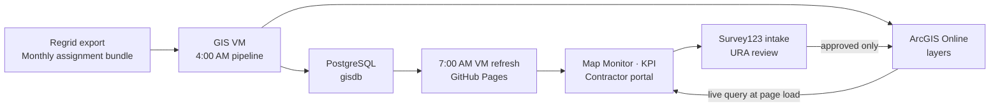

# LandCare Assurance: Owner Handover

For the incoming owner of `ura-gis/land-care-assurance`. Read this once to understand what
you own, what is finished, what is not, and how to keep building it with an AI coding agent.
It sits above [`HANDOVER.md`](../HANDOVER.md) (cutover checklist) and
[`docs/landcare-quick-handover.md`](landcare-quick-handover.md) (short operating guide).

**What the product is.** LandCare Assurance answers one question for URA supervisors: for
this service period, which assigned parcels were actually serviced, by whom, with what
evidence. It is a map-first web application published from this repository, reading live
ArcGIS layers, backed by a nightly job on the GIS VM.

**Live routes** under `https://ura-gis.github.io/land-care-assurance/`: `/monitoring/`
(supervisor map), `/kpi/` (executive dashboard), `/contractor/` (progress view and
submission), `/survey-submission/` (redirect for old links), `/design-system/example.html`.

**Service period convention.** A period runs the 15th of one month through the 14th of the
next, stored as the 15th of the start month. `2026-06-15` means the June to July period.
Every count in the product is scoped to a period.

---

## 1. System architecture and data flow

| Layer | Where it runs | Who owns it |
|---|---|---|
| Ingestion | GIS VM Task Scheduler, repo `URA-GIS-User/URA-Data-Repository` | GIS and data operations |
| Store | PostgreSQL `gisdb` and ArcGIS Online (`urap.maps.arcgis.com`) | GIS and data operations |
| Publish and application | This repository, GitHub Pages | Web and dashboard owner |



**The rule that explains most confusion.** Live ArcGIS is authoritative at page load. The
JSON and GeoJSON under `docs/landcare/data/` is a fallback cache plus the finance contract.
A map number can change during the day with no commit, because the browser queried ArcGIS
directly. Do not treat the committed files as truth.

**Live sources**, all on `services1.arcgis.com/0DMNBNaacQNEfN4H`:

| Source | Item ID | Used for |
|---|---|---|
| `gisdb_gis_regrid_surveys` | `7a2e1d9bacba461296c54a63f104cf51` | Evidence, photos, comments, service dates |
| `..._bundle_assignments_current_period` | `0b4733cb5d204da6ab936c9f6d49e401` | Current assignment reference |
| `..._bundle_assignments_history` | `df7d77eb57f14c68b717c2cf3cdaada4` | Monthly assignment denominator |
| `gisdb_gis_epp_parcels_full` | live layer | Current URA-owned parcel universe |
| `LandCare_Survey123_Evidence_Parcels` | published layer | Approved evidence, not yet operational |

**The completion metric, in one line.** Numerator is the raw count of survey records whose
normalized parcel number matches an assignment in the active filter. Denominator is Active
assigned. `Request Only` is excluded from the Active denominator. Repeated records are kept
on purpose, so this is not a unique-parcel count. Unique completed parcels are a diagnostic
only. Full glossary in [`landcare-metrics-context.md`](landcare-metrics-context.md).

**Where to make a change.**

| To change | Open (under `docs/landcare/` unless noted) |
|---|---|
| How survey evidence is read, normalized, matched | [`survey-layer.js`](landcare/survey-layer.js) |
| How assignments are read and normalized | [`assignment-layer.js`](landcare/assignment-layer.js) |
| Supervisor map behavior | [`monitoring.js`](landcare/monitoring.js) |
| KPI cards, trends, charts | [`kpi.js`](landcare/kpi.js) |
| Contractor progress and submission | [`contractor-overview.js`](landcare/contractor-overview.js) |
| Survey123 URL, prefill names, evidence layer URL | [`survey-submission-config.js`](landcare/survey-submission-config.js) |
| Nightly VM job and its QA gate | `scripts/refresh_landcare_dashboard.ps1`, `scripts/validate_landcare_daily_refresh.py` |

`survey-layer.js` and `assignment-layer.js` are the boundary between ArcGIS and the
application. Source field renames get absorbed there and nowhere else. That is why
`additional_comments`, `additional_notes`, and `notes` all normalize to one property.

**Daily operating check.** Confirm the 4:00 AM upstream pipeline ran and ArcGIS layer
freshness moved. Confirm the 7:00 AM task and read
`C:\srv\logs\land-care-assurance\daily-refresh-status.json`. If it is not `success`, read
`failed_stage` and fix only that stage. Confirm the Pages workflow is green.

---

## 2. Replacing Regrid with a URA-controlled front end

**Scope it honestly.** Regrid provides one thing that URA does not yet own: the contractor
capture form and its daily export, which lands in `gis.regrid_survey_submissions` and
publishes to `gisdb_gis_regrid_surveys`. Assignments, parcel geometry, ownership, the
dashboard, and the contractor portal are already URA property. You are replacing an intake
form and an export, not a platform.

**Most of the replacement already exists in this repository.**

| Piece | Where | State |
|---|---|---|
| Contractor portal with map and list parcel selection | `docs/contractor/`, `contractor-overview.js` | Live |
| Survey123 intake and prefill contract | `survey-submission-config.js` | Live |
| Webhook receiver | [`landcare_survey123_webhook.py`](../landcare_survey123_webhook.py) | Written, not deployed |
| Evidence validation and sync | [`survey123_evidence_sync.py`](../survey123_evidence_sync.py) | Written, not deployed |
| Evidence layer publisher (REST, no ArcGIS Pro license needed) | [`publish_landcare_survey_evidence_parcels.py`](../publish_landcare_survey_evidence_parcels.py) | Written, not deployed |
| Database migration | `sql/20260728_landcare_survey123_evidence_parcels.sql` | Not applied |

**What is actually left.** Apply the migration. Set the VM environment variables from
[`survey123-landcare-network-setup.md`](survey123-landcare-network-setup.md). Run the
receiver behind the approved URA HTTPS host. Register the Survey123 webhook for new records
and edits with the `X-LandCare-Webhook-Token` header. Bootstrap the evidence hosted layer
once in the `LandCare - Published Layers` folder and record its item ID. Then run in parallel.

**Stages and their acceptance test.**

| Stage | Outcome | You are done when |
|---|---|---|
| 1. Intake | Contractor picks a parcel on the URA map or list, Survey123 opens prefilled with organization, parcel, address, and period | Map tap and dropdown produce the same prefill for the same `OBJECTID`; anonymous browser loads the form without sign-in |
| 2. Review and evidence | URA approves or rejects in a restricted view; only approved records reach the public evidence layer | One approved submission creates exactly one database row and one evidence feature, even after a webhook retry; pending and rejected records appear nowhere public |
| 3. Cutover | Map Monitor and KPI read the URA evidence source instead of Regrid | Two full service periods of parallel running with matching counts, parcel matches, contractors, dates, comments, and photos |

**Guardrails, not preferences.** Never publish the raw Survey123 point layer or the review
QA view on a public map. No publisher token, password, or portal credential goes into
GitHub Pages, because Pages content is public. Public views are add-only for submission and
query-only for reference. Only approved evidence becomes visible.

**After sign-off**, repoint Map Monitor and KPI, update
[`landcare-metrics-context.md`](landcare-metrics-context.md) and the tests in the same pull
request, then retire the Regrid scheduled task and its credential. Retiring Regrid also
removes the browser-automation download step, which is the most fragile part of the current
pipeline.

**If Survey123 becomes the limitation**, replace only the form. Build a custom LandCare form
that posts to a protected URA API which validates and writes to PostgreSQL or a secured
feature service. Keep the browser adapter contract unchanged: parcel number, period,
contractor, service date, image URL, and canonical `additional_notes`. The application does
not need to know which form produced the record.

---

## 3. Working with Codex and AI agents on this repository

[`AGENTS.md`](../AGENTS.md) at the repository root is read automatically by Codex. It sets
the source-of-truth rules, the change rules, and the verification requirement. Keep it
current, because it is the cheapest way to stop an agent from doing the wrong thing.

**Standing prompt.** Paste this above any task.

```text
Work in the land-care-assurance repository. Read AGENTS.md, HANDOVER.md,
docs/landcare-architecture.md, and docs/landcare-metrics-context.md first.
Goal: [business outcome and which page it affects].
Source: [ArcGIS item, service, PostgreSQL table, or published JSON].
Metric rule: completion uses raw assignment-matched survey records over Active
assigned; Request Only is excluded from the Active denominator.
Before editing, state the source, field mapping, affected pages, tests, and
rollback. Preserve live ArcGIS-first behavior with static fallback, HTML escaping
of ArcGIS values, URL validation, record ordering, evidence deduplication, and
shared adapter cache-busting versions.
Implement the smallest complete change. Run the Python tests, the survey-layer
Node test, and the Pages validation. Report the result, the evidence, and the
rollback path before commit.
```

**Task variants.** For a metric or denominator change, add "this changes a published number,
so update `docs/landcare-metrics-context.md` and the affected test in the same change, and
show the before and after value for the latest period." For a new page or restyle, add "use
the design system rules in section 4, and do not introduce a framework or a build step." For
an endpoint or field mapping change, add "change it only in `survey-layer.js` or
`assignment-layer.js`, and keep the normalized property names stable for every consumer."

**Four failure modes specific to this repository.** Agents get these wrong unless told.

1. Denominator drift. An agent will happily switch the numerator to unique parcels because
   it looks more correct. It is not the agreed metric. It changes every published number.
2. Stale cache-busting. Modules import each other with `?v=` strings, for example
   `survey-layer.js?v=20260803-raw-completion-v2`. Change a shared adapter and every
   importer's version must move together, or browsers serve a mixed bundle.
3. Hardcoded endpoints. ArcGIS URLs belong in the two adapter files and in
   `survey-submission-config.js`, nowhere else.
4. Hand-editing generated data. Files under `docs/landcare/data/` come from the VM refresh,
   so hand edits are silently reverted by the next run.

**Verification before any push.**

```bash
python -m unittest discover -s tests
node --test tests/survey-layer.test.mjs
```

`tests/test_handover_contract.py` guards the handover file set and the portability of the
design system CSS. `.github/workflows/pages.yml` validates harder on merge to `master`: all
routes exist, the summary JSON, GeoJSON, and refresh manifest agree on counts, and ownership
values stay within URA and Pittsburgh Land Bank. Treat a red Pages workflow as a data
contract failure, not a deployment failure.

---

## 4. Design system usage

**There are two stylesheets and they are not the same thing.** This is the first thing that
confuses a new contributor.

| File | Size | Use it for |
|---|---|---|
| [`docs/landcare/app.css`](landcare/app.css) | ~2,800 lines | The existing product. Coupled to the ArcGIS JS API 4.30 theme |
| [`docs/design-system/executive-bi.css`](design-system/executive-bi.css) | 156 lines | A new app that should look like LandCare. Portable, no font import |

Changing an existing page means editing `app.css`. Starting a new dashboard means copying
`executive-bi.css` and the markup from `design-system/example.html`. Do not retrofit one
into the other.

**Tokens over components.** Override the `--bi-*` variables at the `.bi-dashboard` level.
Never restyle an individual component to change branding.

```css
.bi-dashboard {
  --bi-primary: #006c9f;  /* primary analysis, active controls */
  --bi-deep:    #00334f;  /* authoritative detail, headings */
  --bi-risk:    #c2410c;  /* action, risk, follow-up */
  --bi-success: #2e7d32;  /* target, complete, stable */
}
```

**Page order is fixed**: masthead, tabs, context and filter row, section intro stating the
decision question, three to five metrics, one dominant map or chart, then an operational
ledger table. Lead with the decision, not the chart type.

**Rules that get checked in review.** Never use color alone; pair every status color with a
text label. Every important number shows its source, period, denominator, and freshness.
Normal text contrast at least 4.5:1. Tabs and actions are real buttons or links with
`aria-selected`. Tables keep `table`, `th`, and `td`. Layout stacks at 760px and below.
Loading, empty, stale, and error states are explicit, because live ArcGIS queries fail in
ways static pages do not. Full detail and a copy-paste build prompt in
[`design-system/agent-brief.md`](design-system/agent-brief.md).

---

## 5. Ownership, open risks, and pending decisions

Five areas have distinct owners: source freshness, VM refresh, application code, contractor
follow-up, and finance. The escalation table lives in [`HANDOVER.md`](../HANDOVER.md) and is
not repeated here.

**Open items to decide, not defects.**

| Item | What it means for you |
|---|---|
| Survey123 evidence path is code-complete but not deployed | Approved photos cannot appear and Regrid stays the only evidence source. The single blocker on the replacement |
| Survey123 submissions do not change official completion in v1 | Whether they should is a governance decision, not a code change |
| Committed snapshot is dated 2026-07-07 while live ArcGIS moves daily | Static and live numbers differ. Decide if the fallback stays once the live path is trusted |
| Morning brief falls back to a GitHub Issue without Microsoft 365 secrets | Set `LANDCARE_EMAIL_RECIPIENTS` and `LANDCARE_ISSUE_ASSIGNEE`, test with `dry-run` first |
| GitHub redirects the old repository path, Pages URLs do not | Every ArcGIS embed, bookmark, and link moves to the `ura-gis` Pages URL by hand |

**Next.** For the cutover checklist read [`HANDOVER.md`](../HANDOVER.md) and
[`github-handover-runbook.md`](github-handover-runbook.md). For daily operations read
[`task-scheduler-vm-operations.md`](task-scheduler-vm-operations.md).
