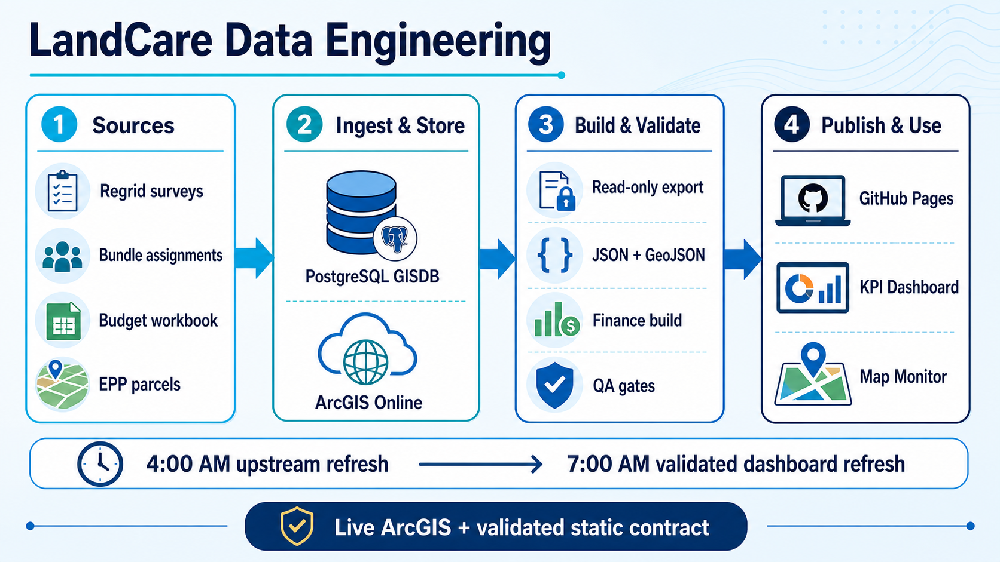
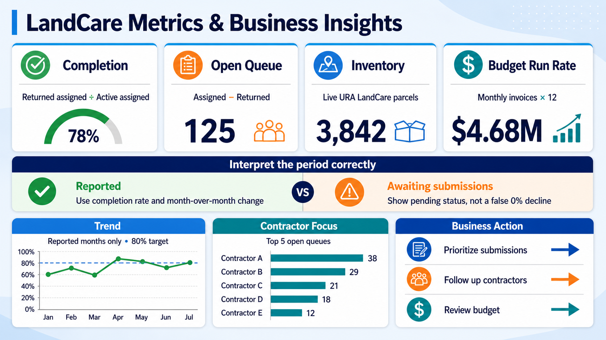

# LandCare Presentation Assets

Last updated: 2026-07-14

This catalog contains reusable 16:9 visuals for LandCare presentations, executive briefings, onboarding, and technical handoffs. The source logic is documented in [LandCare Data Engineering and Visualization Logic](landcare-data-engineering-and-visualization-logic.md).

## Data engineering summary

**File:** [`docs/landcare/assets/landcare-data-engineering-summary.png`](landcare/assets/landcare-data-engineering-summary.png)

**Recommended slide title:** LandCare Data Engineering

**Use for:** Architecture overview, automation briefings, source lineage, technical onboarding, and production-readiness reviews.

**Key message:** Regrid, assignment, budget, and EPP sources flow through PostgreSQL and ArcGIS, then through validated JSON/GeoJSON builds into GitHub Pages, the KPI dashboard, and the map monitor.

## Metrics and business insight summary

**File:** [`docs/landcare/assets/landcare-metrics-business-insights-summary.png`](landcare/assets/landcare-metrics-business-insights-summary.png)

**Recommended slide title:** LandCare Metrics & Business Insights

**Use for:** Executive KPI reviews, contractor-performance discussions, operations meetings, budget reviews, and dashboard training.

**Key message:** Completion, open queue, inventory, and budget metrics must be interpreted with the reporting-period status before they are converted into contractor follow-up and operational action.

## Presentation guidance

- Use each image as a full-width 16:9 slide visual.
- Keep speaker notes separate from the image; detailed definitions belong in the canonical engineering document.
- Do not replace the pending-period rule with a zero completion value. `Awaiting submissions` is a data-availability state, not a performance result.
- Recheck current production values before adding numeric callouts around these conceptual visuals.
- Preserve the original PNG files so future decks can import them without recompression.
