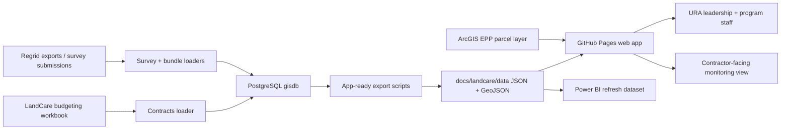

# LandCare Monitoring Production Data Engineering Plan

## Current State

The LandCare monitoring site now has two production-facing views:

- `docs/monitoring/index.html`: map monitor for current URA-owned LandCare parcels, council district focus, contractor filter, status legend, and action focus.
- `docs/kpi/index.html`: KPI dashboard with current universe, latest survey completion, contractor performance, budget, check request history, parcel area, parcel detail, and maintenance expense tabs.

The latest web data was refreshed from PostgreSQL on 2026-06-24. The current dashboard data includes survey history through 2026-05 and assignment data through 2026-06-15.

## Target Architecture



## What Needs To Be Built

1. Standardize the VM refresh environment.

Install Python, Git, and the package set in `requirements-landcare-refresh.txt`. Keep database credentials in a VM-only `.env` file, never in the repo.

2. Automate PostgreSQL-to-web exports.

Use `scripts/export_landcare_postgres_data.py` to run `prototype/sql/export_prototype_data_readonly.sql`, write `prototype/source/app_ready_parcels_monthly.geojson`, and rebuild the published dashboard files with `scripts/build_landcare_web_data.py`.

3. Keep finance data in the same refresh cycle.

Use `scripts/build_landcare_finance_data.py` to rebuild `docs/landcare/data/finance_summary.json` from the LandCare budgeting workbook that is also loaded to PostgreSQL by `ContractsDriveToSQL.py`.

4. Schedule refresh and publish.

Run `scripts/refresh_landcare_dashboard.ps1` from Windows Task Scheduler after the monthly survey and bundle loaders complete. The script rebuilds the dashboard data, commits changed files, and pushes to GitHub Pages.

5. Add Power BI consumption contract.

Power BI should consume the same refreshed data contract used by the web dashboard: `monthly_metrics.json`, `contractor_monthly.json`, `kpi_summary.json`, and `finance_summary.json`. This avoids one metric definition in Power BI and another in the monitoring site.

## VM Setup

Recommended folder layout:

```powershell
C:\srv\land-care-assurance
C:\srv\land-care-assurance\.venv
C:\srv\logs\land-care-assurance
```

One-time setup:

```powershell
cd C:\srv
git clone https://github.com/rutomo-ura/land-care-assurance.git
cd C:\srv\land-care-assurance
py -3.12 -m venv .venv
.\.venv\Scripts\python -m pip install -r requirements-landcare-refresh.txt
```

Create `C:\srv\land-care-assurance\.env` on the VM:

```powershell
PG_HOST=10.0.101.57
PG_PORT=5432
PG_DB=gisdb
PG_USER=rutomo
PG_PASSWORD=<store-on-vm-only>
```

Manual refresh command:

```powershell
cd C:\srv\land-care-assurance
.\scripts\refresh_landcare_dashboard.ps1 -RepoRoot C:\srv\land-care-assurance
```

## Refresh Schedule

- Daily: optional data integrity smoke check after survey submissions are expected.
- Monthly: run the full refresh after bundle assignment and survey completion exports are loaded.
- After contract updates: run finance refresh immediately so budget and maintenance tabs stay aligned.

Recommended Task Scheduler cadence:

- Monthly full refresh: 16th day of each month, 7:00 AM Eastern.
- Weekly smoke refresh: every Monday, 7:30 AM Eastern.

## Data Quality Checks

The refresh should fail loudly when:

- PostgreSQL connection fails.
- No URA-owned LandCare records are exported.
- Latest survey month moves backward.
- Latest assignment month moves backward.
- Survey return count is zero for a month that should be closed.
- The generated JSON files are missing or invalid.

## Next Improvements

- Add district-level completion rollups to the KPI dashboard.
- Add contractor SLA thresholds for red/yellow/green completion status.
- Add a Power BI dataflow or semantic model that reads the same dashboard JSON contract.
- Move finance workbook ingestion fully behind PostgreSQL once parcel count and acreage fields are available in `gis.land_care_budgeting_contracts`.
- Add GitHub Actions smoke checks for JavaScript syntax and JSON validity before publishing.
