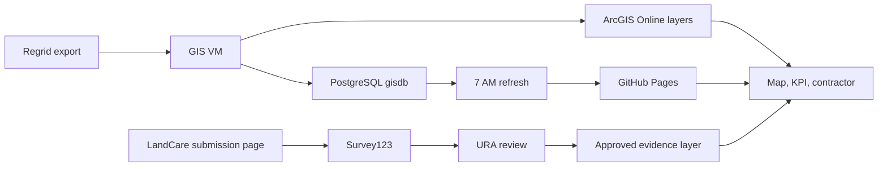

# LandCare Quick Handover

> Superseded by [`handover/`](../handover/). That folder is the current entry point for taking over this project. This document is kept for its detail and history.

Purpose: explain how LandCare works today, how to maintain it with Codex, and how to replace Regrid with a URA-controlled contractor front end while keeping ArcGIS as the GIS platform.

## 1. System architecture and data flow

LandCare has three working layers:

1. **Data and ingestion.** Regrid survey exports and monthly assignment bundles are loaded by the GIS VM into PostgreSQL `gisdb` and published to ArcGIS Online.
2. **GIS services.** ArcGIS hosts the live survey, assignment, EPP parcel, council district, and approved evidence layers. These are the main browser data sources.
3. **Business application.** This repository publishes Map Monitor, KPI, contractor, and survey-submission pages through GitHub Pages. The browser joins assignments and survey evidence by normalized parcel number and period.



| Area | Current source or location | Business use |
|---|---|---|
| Survey evidence and comments | ArcGIS item `7a2e1d9bacba461296c54a63f104cf51`, `regrid_surveys/FeatureServer/0` | Live photos, service dates, comments, field notes, and completion matching |
| Assignment denominator | Current item `0b4733cb5d204da6ab936c9f6d49e401` and history item `df7d77eb57f14c68b717c2cf3cdaada4` | Contractor, parcel, maintenance level, and reporting period |
| Current LandCare parcel universe | `gisdb_gis_epp_parcels_full` | Current URA-owned LandCare parcels and map geometry |
| Static fallback and finance | `docs/landcare/data/` | Fallback JSON and GeoJSON, finance totals, and refresh metadata |
| Public application | `https://ura-gis.github.io/land-care-assurance/` | Map Monitor, KPI, contractor portal, and submission page |

The current completion numerator is the raw count of survey records whose normalized `parcelnumb` matches an assignment in the selected filter. It is not a unique-parcel count. Request Only records remain outside the Active completion denominator.

## 2. Replace Regrid with a URA-controlled front end

Use a staged replacement. Do not replace the reporting source and contractor workflow on the same day.

### Stage 1: keep the custom front end and use Survey123 for submission

- Read active assignments from the public query-only ArcGIS current and history layers.
- Let the contractor select a period, organization, and parcel from the same map and list controls.
- Pass `organization`, `parcel_number`, `address`, and `assignment_period` into Survey123.
- Capture service date, work questions, comments, and photo attachments.
- Store new records as `review_status = pending`. Contractors cannot edit review fields.

### Stage 2: validate and approve evidence

- Use a restricted Survey123 review view or Inbox for URA approval and rejection.
- Send new and edited records to the VM webhook.
- Validate assignment ID, parcel number, contractor, and period against the authoritative assignment layer.
- Mirror valid records into PostgreSQL and publish only approved parcel polygons and approved attachment links to a public read-only ArcGIS view.
- Never publish the raw Survey123 point layer, private review fields, tokens, or unapproved photos.

### Stage 3: cut over from Regrid

- Run Regrid and the new path together for at least two service periods.
- Compare counts, parcel matches, contractors, dates, comments, photos, rejected records, and unmatched records.
- Keep the shared browser adapter contract: parcel number, period, contractor, service date, image URL, and canonical `additional_notes`.
- After business sign-off, point Map Monitor and KPI to the approved URA source, update metric documentation and tests, then retire the Regrid task and credentials.

If Survey123 later limits the contractor experience, replace only the form with a custom LandCare form. The browser should submit through a protected URA API. That service performs validation and writes to PostgreSQL or a secured ArcGIS feature service. Do not place publisher credentials in GitHub Pages or allow anonymous update and delete access to an authoritative layer.

## 3. Common Codex prompt

```text
Work in the land-care-assurance repository. Read HANDOVER.md, AGENTS.md,
docs/landcare-architecture.md, docs/landcare-metrics-context.md, and the
relevant submission or VM runbook before editing.

Goal: [describe the business outcome and affected page].
Source: [ArcGIS item, service, PostgreSQL table, or published JSON].
Metric rule: completion uses raw assignment-matched survey records; Request
Only is excluded from the Active denominator.

Before editing, state the source, field mapping, affected pages, tests, and
rollback. Preserve live ArcGIS-first behavior, HTML escaping, URL validation,
record ordering, evidence deduplication, and shared adapter cache versions.
Do not add credentials or edit generated data by hand.

Implement the smallest complete change. Run Python tests, the survey-layer
Node tests, Pages validation, and a read-only ArcGIS smoke test. Summarize the
result, test evidence, and rollback path before commit and push.
```

## 4. Design system and release rules

Copy `docs/design-system/executive-bi.css` and the relevant markup from `example.html`. Wrap the new page in `.bi-dashboard`. Change branding through the `--bi-*` tokens instead of editing each component.

Use this page order: masthead, context and filters, decision heading, three to five KPIs, one main map or chart, and an operational ledger. Blue means primary analysis, navy means authoritative detail, orange means follow-up, and green means complete or stable. Always include a text label with color.

Every important number must show its source, period, denominator, and freshness. Keep controls keyboard accessible, normal text contrast at least 4.5:1, mobile stacking below 760 px, and clear loading, empty, stale, and error states.

Before release:

- Confirm ArcGIS layers are query-only where public and restricted where they contain review data.
- Run the repository tests and open Map Monitor, KPI, contractor, and survey-submission pages.
- Verify counts, comments, photos, field notes, filters, and the selected reporting period.
- Check the VM status JSON after scheduled workflow changes.
- Use a focused branch and pull request. Record source, denominator, affected page, test command, and rollback.

Canonical references: `HANDOVER.md`, `AGENTS.md`, `docs/landcare-architecture.md`, `docs/landcare-submission-and-evidence-flow.md`, `docs/survey123-landcare-network-setup.md`, `docs/landcare-metrics-context.md`, and `docs/design-system/README.md`.
