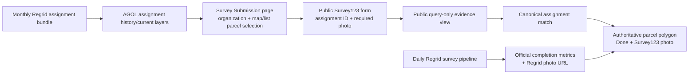

# LandCare submission and evidence flow

Last updated: 2026-07-15

This is the canonical handoff for the contractor submission path and its relationship to the existing Regrid dashboard pipeline. It complements [`landcare-architecture.md`](landcare-architecture.md), which remains the canonical source for daily data engineering and KPI rules.

## Outcome

A contractor can anonymously choose an assigned parcel from a list or map, submit service evidence in Survey123, and receive a clear record of what parcel and period were used. A submission with a matching parcel, period, contractor, assignment ID, and image attachment immediately marks the authoritative assignment polygon complete. The submitted point is evidence storage only and is never shown on the public map.



## What is live now

| Capability | Status | Notes |
|---|---|---|
| Anonymous Survey123 form | Live | Survey item `02a003254ba546c28b4997b42e0f220b` is shared publicly. |
| Assignment month, contractor, and parcel selection | Live | Uses the two newest periods in AGOL assignment history. |
| Map/list synchronized selection | Live | Tap an outlined parcel or choose the dropdown; both select the same `OBJECTID`. |
| Parcel shape rendering | Live | Handles both numeric vertices and historical `"longitude latitude"` string vertices. |
| Survey123 prefill | Live | Sends organization, parcel number, address, and assignment period as URL parameters. |
| Regrid photo URL in Map Monitor | Live | Existing Regrid evidence remains the default photo evidence source. |
| Approved Survey123 evidence pipeline | Code and database ready | Requires VM receiver deployment, webhook registration, and a public HTTPS evidence endpoint. |

## Data engineering contract

### 1. Assignment reference

The submission page reads public, query-only ArcGIS layers:

- Current: `gisdb_gis_regrid_bundle_assignments_current_period`
- History: `gisdb_gis_regrid_bundle_assignments_history`

The page filters the selected `period_label` and `maintained_by`, excludes Request Only assignments, and uses the source `OBJECTID` as the selection key. It passes these fields to Survey123:

| Form field | Assignment source |
|---|---|
| `organization` | `maintained_by` |
| `parcel_number` | `parcelnumb` with `alco_pin` fallback |
| `address` | `address` |
| `assignment_period` | `period_label` / `service_period_label` |

### 2. Public submission and review

Public Survey123 submissions are evidence candidates, not official metrics. Required contractor/service fields mirror Regrid and include a required photo attachment. The public form must write `review_status = pending`; review fields stay hidden from contractors.

URA reviewers use the restricted Inbox to set `approved` or `rejected`, including reviewer, time, and reason. Rejected or pending records are never published through the evidence feed.

### 3. Approved-evidence storage

The VM receiver in [`scripts/landcare_survey_webhook.py`](../scripts/landcare_survey_webhook.py) validates webhook requests, deduplicates by Survey123 global ID, retrieves the attachment URL, and upserts only approved records into:

```text
gis.ura_landcare_survey_submissions_internal
```

The curated public view is:

```text
gis.landcare_approved_survey_evidence
```

The migration is [`sql/20260715_landcare_survey_submission_internal.sql`](../sql/20260715_landcare_survey_submission_internal.sql).

### 4. Map evidence behavior

Map Monitor looks for the latest matching Regrid evidence first unless an approved Survey123 record is available from the configured evidence feed. It shows a thumbnail only on hover/selection and opens the full image in a safe new tab. The source label makes the distinction explicit:

- `Regrid survey photo`
- `Approved Survey123 photo`

## Metric governance

| Question | v1 rule |
|---|---|
| What drives official completion? | Assignment-matched Regrid returned evidence divided by Active assigned parcels. |
| Do Survey123 submissions change completion? | No. They are separate internal evidence until a future governance decision. |
| Can a pending Survey123 photo be public? | No. |
| Can an approved Survey123 photo be public? | Yes, only through the approved evidence view and public read-only attachment URL. |

## VM completion checklist

The form and client are live. To complete the controlled evidence path:

1. Apply the SQL migration.
2. Configure the VM-only secrets described in [`survey123-landcare-network-setup.md`](survey123-landcare-network-setup.md).
3. Run the FastAPI receiver behind URA HTTPS.
4. Register Survey123 new-record and edit webhooks with `X-LandCare-Webhook-Token`.
5. Set `APPROVED_EVIDENCE_GEOJSON_URL` to the receiver's `/public/approved-evidence` URL.
6. Submit, approve, reject, retry, and duplicate-delivery test cases before making approved evidence operationally relied upon.

## Validation checklist

- Anonymous browser can load the public Survey123 form without sign-in.
- Contractor map tap and dropdown selection produce the same parcel/address/period prefill.
- A string-vertex historical parcel and a numeric-vertex current parcel both draw correctly.
- Pending/rejected submissions do not appear in PostgreSQL approved view or Map Monitor.
- Approved submission creates one PostgreSQL row and one evidence-feed feature, even after webhook retry.
- Regrid and Survey123 photos are labelled by source and load only on hover/detail.
