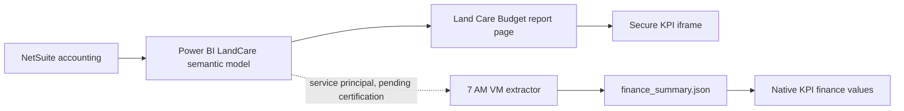

# Power BI LandCare data-flow audit

**Audit date:** August 5, 2026  
**Scope:** Land Care Budget and Parcel Area Distribution. Maintenance Expenses and Maintenance Check Requests are excluded.

## Handover conclusion

The secure Power BI report is live and refreshed. The GitHub Pages KPI is not yet receiving its native finance contract from the Power BI semantic model. The iframe and the native KPI data pipeline are separate paths and must be checked separately.

## Evidence

| Check | Result |
|---|---|
| Correct report page | `fe756b7016e6baa7351e`, titled **Land Care Budget** |
| Incorrect prior page | `8c93bab49c96aa8e3bd2`, showing Maintenance Check Requests |
| Report freshness | Power BI header showed `Data updated 8/5/26` |
| Report filter | `Item Type is Landcare`; Maintenance Expenses is a separate report page |
| Report reconciliation | `$458,995.17 = $188,579.00 + $192,318.50 + $78,097.67`; `$458,995.17 / $775,000.00 = 59.23%` |
| Parcel Area page | `4a5502453e9080b7a655`, titled **Parcel Area Distribution**; the visual exposes **Show as a table** and **Export data** to authorized viewers |
| Parcel Area spot checks | July 15, 2026 showed Amani at `78,546` sq ft against a `78,546` baseline; Chatman showed `2,019,558` sq ft against a `2,019,758` baseline |
| Public JSON state | August 4 file has no `semantic_summary` and identifies NetSuite/workbook as its source |
| Workspace access | Shared report is viewable; configured workspace is not accessible to the audited user |
| VM proof | Production task status, secret-name configuration, and `powerbi-finance-check.json` were not available on this workstation |

## Why the two pages differed

The KPI iframe used a valid report ID but the wrong page ID. Power BI therefore loaded successfully while opening Maintenance Check Requests. The fix keeps the report, workspace, tenant, and authentication settings unchanged and replaces only `pageName` with the Land Care Budget page ID.

## Ownership table finding

The quarterly page combined assignment ownership rows with finance fields that were not populated in the published contract. This produced repeated `Unavailable` cells. The handover version shows only source-backed fields: owner, parcels, and parcel share. Unsupported fields are also removed from the CSV export.

## Parcel Area implementation

The prior native Parcel Area table was empty because the published `area_compliance.json` contained null square-foot values. A temporary runtime implementation combined live ArcGIS assigned area with a Power BI-validated baseline, but the two sources can differ. The native table and external month filter were removed. Parcel Area now relies entirely on the secure Power BI report and its internal organization and period controls.

This is intentionally not live browser scraping. A browser session is useful for a one-time comparison, but it cannot safely support the unattended 7 AM job. The authenticated Power BI embed remains the sole Parcel Area presentation surface.

## Production sign-off

The successor and Power BI administrator should complete these checks on the production VM:

1. Confirm the service principal has Read and Build access to semantic model `924c6c0b-6e29-41cf-9775-562ca646953a`.
2. Confirm the latest model refresh completed successfully and inspect its gateway/data-source connections.
3. Run `scripts/extract_landcare_powerbi_semantic.py` with the secured environment configuration.
4. Confirm `finance_summary.json` contains `semantic_summary`, `source_system: Power BI semantic model`, and `feed_status: current`.
5. Confirm `daily-refresh-status.json` contains a successful `power_bi_finance` block.
6. Reconcile the published annual and quarter values to the report at the same timestamp.
7. Verify one unattended 7 AM run before declaring the native finance feed live.

If extraction fails, retain the last successful aggregate output, mark it stale, and continue the GIS refresh. Never publish tokens, certificates, raw Power BI responses, transaction identifiers, or memos.
