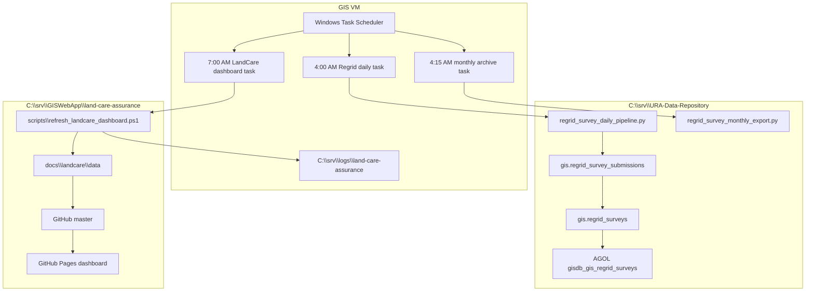
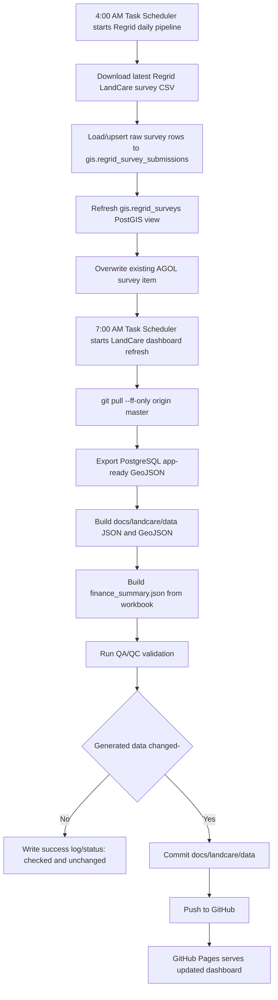
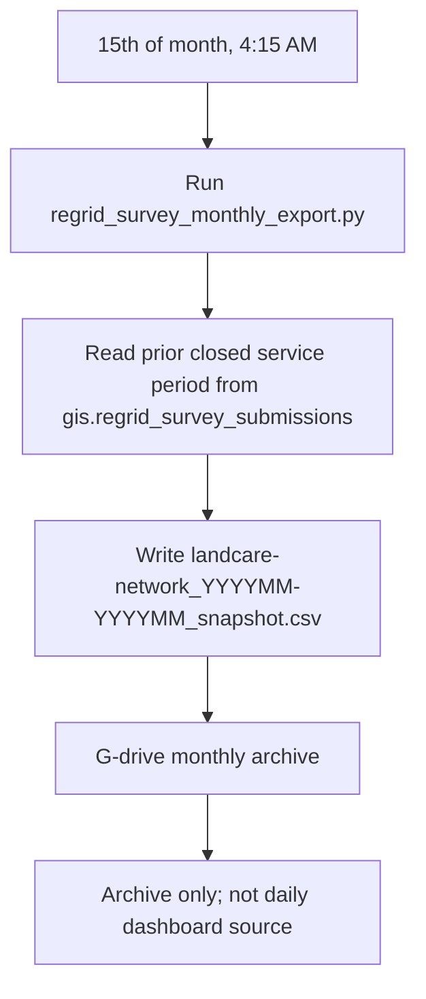
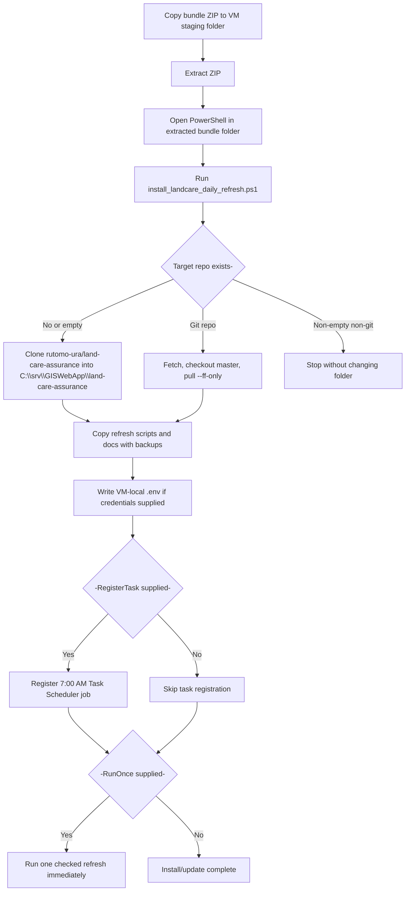
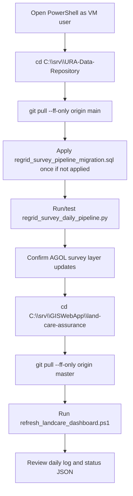
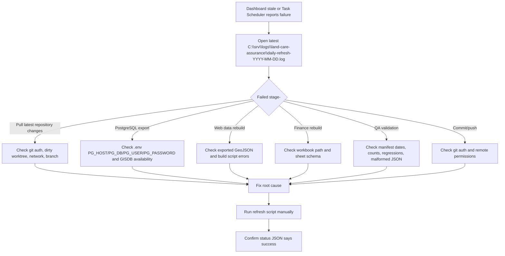
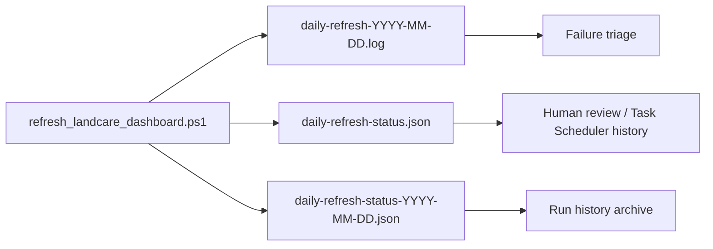
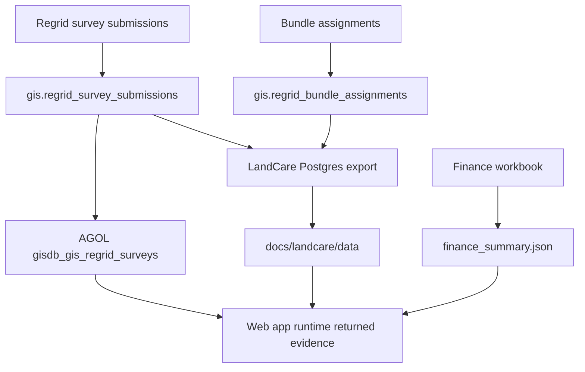

# LandCare Task Scheduler VM Operations

Last updated: 2026-07-07

This is the operational runbook now that Power Automate is not available. Windows Task Scheduler, local logs, and local status JSON are the control plane.

## Operating Model



## Daily Scheduled Flow



## Task Registration Standard

Update `\GIS Automations\LandCare-Daily-Dashboard-Refresh.task` using the approved `DOMAIN\landcare-refresh` service account (or the locally approved equivalent), not an interactive personal account. The registration script requires a password-backed principal, verifies that the stored principal uses `Password` logon, runs at highest privilege, retries three times at 15-minute intervals, starts missed runs when available, and stops a run after two hours.

```powershell
cd C:\srv\GISWebApp\land-care-assurance
.\scripts\register_landcare_daily_refresh_task.ps1 `
  -RepoRoot C:\srv\GISWebApp\land-care-assurance `
  -TaskUser "DOMAIN\landcare-refresh" `
  -PromptForTaskPassword

Get-ScheduledTask -TaskPath "\GIS Automations\" -TaskName "LandCare-Daily-Dashboard-Refresh.task" |
  Select-Object TaskName, TaskPath, State, @{Name="RunAs";Expression={$_.Principal.UserId}}, @{Name="LogonType";Expression={$_.Principal.LogonType}}, @{Name="RunLevel";Expression={$_.Principal.RunLevel}}
Get-ScheduledTaskInfo -TaskPath "\GIS Automations\" -TaskName "LandCare-Daily-Dashboard-Refresh.task" |
  Select-Object LastRunTime, LastTaskResult, NextRunTime
```

Release evidence requires a successful manual run, followed by a successful scheduled invocation (`Start-ScheduledTask`), a `LastTaskResult` of `0`, and a same-day `daily-refresh-status.json` with `status: success`.

Run the proof command after registration. It starts the task, waits for it to finish, checks the exit result and same-day status JSON, and saves a durable verification JSON beside the daily logs:

```powershell
.\scripts\test_landcare_scheduled_refresh.ps1
```

## Monthly Archive Flow



## Bundle Install / Update Flow



## Manual VM Update Flow



Commands:

```powershell
cd C:\srv\URA-Data-Repository
git pull --ff-only origin main
psql -h localhost -U postgres -d gisdb -f sql\regrid_survey_pipeline_migration.sql
C:\ProgramData\ESRI\conda\envs\arcgispro-py3-clone\python.exe .\regrid_survey_daily_pipeline.py

cd C:\srv\GISWebApp\land-care-assurance
git pull --ff-only origin master
.\scripts\refresh_landcare_dashboard.ps1 -RepoRoot C:\srv\GISWebApp\land-care-assurance
```

## Failure Triage Flow



## Local Monitoring Artifacts



| Artifact | Path | Use |
|---|---|---|
| Current run status | `C:\srv\logs\land-care-assurance\daily-refresh-status.json` | Quick success/failure check |
| Dated status | `C:\srv\logs\land-care-assurance\daily-refresh-status-YYYY-MM-DD.json` | Historical run record |
| Transcript log | `C:\srv\logs\land-care-assurance\daily-refresh-YYYY-MM-DD.log` | Full troubleshooting log |
| Task history | Windows Task Scheduler UI | Confirms scheduled trigger and exit code |

## Source Rules



- Daily survey source of truth: `gis.regrid_survey_submissions`.
- Runtime returned survey map layer: AGOL `gisdb_gis_regrid_surveys`.
- Assignment denominator source: `gis.regrid_bundle_assignments`.
- Finance source: LandCare budgeting workbook.
- G-drive survey CSV: archive only.
- Metric definitions and denominator rules: [`docs/landcare-metrics-context.md`](landcare-metrics-context.md).
