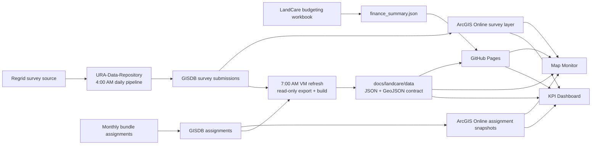
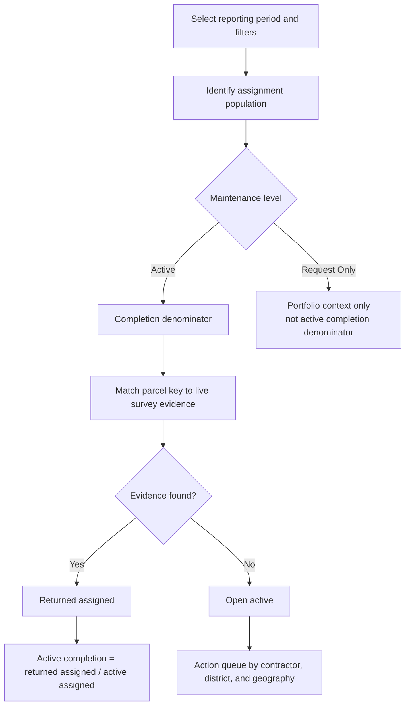
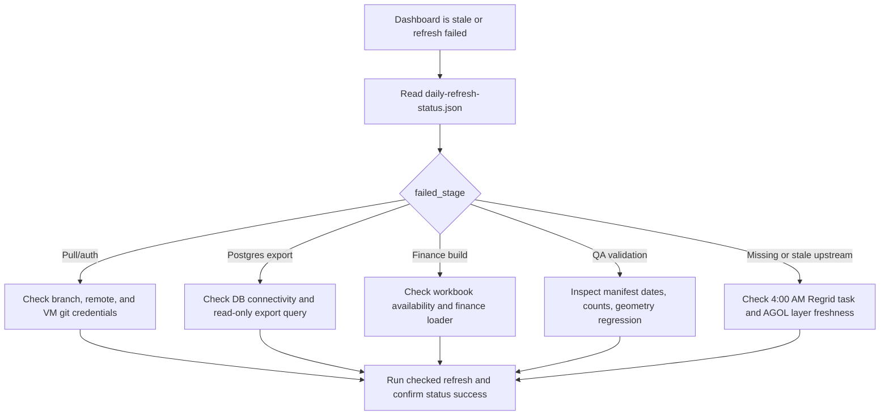

# LandCare Assurance v1.0 operational handover

**Release:** v1.0.0
**Repository:** [rutomo-ura/land-care-assurance](https://github.com/rutomo-ura/land-care-assurance)
**Production surfaces:** [Map Monitor](https://rutomo-ura.github.io/land-care-assurance/monitoring/) and [KPI Dashboard](https://rutomo-ura.github.io/land-care-assurance/kpi/)

## 1. Purpose and problem statement

LandCare has several legitimate operational views of the portfolio: current URA-owned inventory, monthly bundle assignments, survey returns, and finance contracts. Before v1.0, those views were difficult to reconcile quickly and were split across operational files, ArcGIS layers, and reporting tools. This creates three business risks:

1. Leadership cannot quickly see whether a low completion rate reflects missing evidence, an assignment denominator issue, or a contractor follow-up problem.
2. Supervisors cannot reliably move from a portfolio metric to the parcels and geography requiring action.
3. Daily data refresh and publishing rely on an operational chain that needs explicit ownership, logging, and validation.

**v1.0 response:** one source-aware operating layer that connects live ArcGIS evidence, published data contracts, KPI decision views, a map-first workflow, and a daily VM refresh procedure.

## 2. What is delivered

| Area | v1.0 capability | Primary user outcome |
|---|---|---|
| Map Monitor | Live ArcGIS-first map with period, district, contractor, status, and color-mode controls | Find work that needs geographic follow-up |
| Executive KPI Dashboard | Completion, contractor queue, finance, parcel area, and operational ledger views | Read portfolio performance without navigating raw data |
| Executive map brief | A3 landscape print/export with strategic defaults and user-selectable metrics | Share a focused decision brief rather than a generic map screenshot |
| Published data contract | JSON/GeoJSON used by the web app, with finance data and refresh metadata | Keep web views repeatable and auditable |
| Daily operations | Scheduled refresh, log/status artifacts, validation script, install/runbook | Detect and recover from failed or stale refreshes |
| Morning executive brief | GitHub Issue assigned to the dashboard owner with published metric movement | Review daily survey, queue, and contractor movement without assembling a manual update |
| Reusable design system | Portable executive BI CSS, markup patterns, and example page | Reuse the visual standard in future operational dashboards |

## 3. System architecture



## 4. Business reasoning and metric logic

The product avoids treating one count as universal. Each metric is shown with its source and denominator so users can act without blending incompatible populations.



### Source-of-truth rules

| Business question | Authoritative source | Do not substitute |
|---|---|---|
| Current URA-owned LandCare universe | Live AGOL EPP parcel layer | Historical bundle assignment counts |
| Monthly assignment denominator | Live AGOL assignment snapshot, with published fallback | Raw survey count |
| Survey coverage | Live AGOL all-period survey layer | Static export alone |
| Active completion | Assignment-matched returned evidence divided by Active assigned | All raw survey records divided by all parcels |
| Finance and contract exposure | `finance_summary.json` built from the budgeting workbook | Current inventory count |

**Important:** Request Only parcels are portfolio context and are excluded from the Active completion denominator. Raw survey coverage is not identical to assignment-matched returned evidence.

## 5. Current release evidence

The checked-in v1.0 data snapshot was generated on **2026-07-14**. Its latest comparable reporting month is **2026-06**; assignment freshness is **2026-07-15** and survey freshness is **2026-06-15**.

| Release indicator | Checked-in evidence |
|---|---:|
| All-month URA-owned parcel-month records | 2,776 |
| Latest month assignments | 210 |
| Active assigned | 176 |
| Returned assigned | 43 |
| Active completion | 24.4% |
| Open active | 133 |
| Request Only | 34 |
| Annual finance run rate | $775,000 |
| Contract portfolio value | $1,550,000 |

These values are release evidence, not a perpetual performance claim. The web app enriches survey and assignment evidence from live ArcGIS at runtime; refresh metadata remains the operational source for data freshness.

## 6. Operating model

### Daily schedule

| Eastern time | Owner/system | Required outcome |
|---|---|---|
| 4:00 AM | Upstream `URA-Data-Repository` task | Ingest Regrid survey evidence into GISDB and publish the live survey layer |
| Monthly cycle | Upstream bundle task | Load/update bundle assignments and assignment snapshots |
| 7:00 AM | LandCare VM task | Pull `master`, rebuild published data, validate, and push changed data |
| 9:00 AM | GitHub Actions | Create the assigned executive brief from the latest two published data snapshots |
| After a failure | GIS/data operator | Read status JSON and daily transcript; resolve named stage before rerun |

### VM health check

Run on the GIS VM after installation, deployment, or a failed daily cycle:

```powershell
cd C:\srv\GISWebApp\land-care-assurance
.\.venv\Scripts\python.exe scripts\validate_landcare_daily_refresh.py
Get-Content C:\srv\logs\land-care-assurance\daily-refresh-status.json | ConvertFrom-Json |
  Select-Object status, outcome, run_date, failed_stage, message, upstream
```

Expected result: validator exits successfully and status JSON reports `status: success`. For a complete scheduler proof, follow [`vm-smoke-test-regrid-daily-sync.md`](vm-smoke-test-regrid-daily-sync.md).

### Failure triage



## 7. Handover responsibilities

| Role | Owns | Trigger for action |
|---|---|---|
| GIS/data operations | Regrid ingestion, GISDB/AGOL data freshness, scheduled-task health | Upstream survey/assignment period is stale or layer counts regress |
| LandCare program operations | Contractor follow-up and review of open active work | KPI or map shows open concentration, low completion, or evidence gap |
| Finance owner | Budget workbook accuracy and finance contract context | Monthly/annual spend or contractor contract change |
| Web/dashboard owner | GitHub Pages release, app UI, data-contract compatibility | Release, display issue, or downstream schema change |
| Leadership | Definition decisions and exception escalation | Metric definition, performance policy, or operational threshold changes |

## 8. Map export behavior

**Default Executive Map Brief metrics:** Completion rate, open active parcels, returned evidence, active assigned parcels, and annual budget plan.

**Optional metrics:** monthly spend, total assigned, Request Only, selected acres, neighborhoods covered, and contractor open-work rank. The dialog disables metrics that are not available for the active filter state. The PDF preserves the filtered map, title context, legend, action focus, generated time, and source footer.

Manual acceptance check before a formal meeting: export once with defaults and once with a custom selection; in browser print preview confirm all content fits one A3 landscape page.

## 9. Release readiness checklist

| Control | Evidence / action | Status at v1.0 packaging |
|---|---|---|
| Repository versioned | `master` contains Map Monitor, KPI, data contract, and operations docs | Ready |
| GitHub Pages configured | `.github/workflows/pages.yml` deploys `docs/` on `master` changes | Ready |
| Static data contract guarded | Pages workflow verifies required data files and counts | Ready |
| Daily validation implemented | `scripts/validate_landcare_daily_refresh.py` validates JSON, counts, freshness and finance | Ready |
| Scheduler runbook available | VM install, registration, smoke test, and log paths documented | Ready |
| Metric definitions documented | `landcare-metrics-context.md` | Ready |
| Browser print visual check | Manual print-preview inspection of the executive map brief | Presenter preflight when export is shown live |
| VM scheduler proof | Git audit shows daily `Refresh LandCare dashboard data` publishes at approximately 07:01 Eastern from 2026-07-04 through 2026-07-14, including `c1e5267` on 2026-07-14 | Verified through published output history; continue routine status-JSON checks on the target VM |

## 10. Key artifacts

- [`README.md`](../README.md) - installation and daily refresh entry point
- [`landcare-architecture.md`](landcare-architecture.md) - canonical system architecture
- [`landcare-metrics-context.md`](landcare-metrics-context.md) - metric definitions and denominator rules
- [`task-scheduler-vm-operations.md`](task-scheduler-vm-operations.md) - operations and failure triage
- [`vm-smoke-test-regrid-daily-sync.md`](vm-smoke-test-regrid-daily-sync.md) - VM proof checklist
- [`design-system/README.md`](design-system/README.md) - reusable executive BI pattern
- [`v1.0-presentation-script.md`](v1.0-presentation-script.md) - meeting-ready narrative and speaker script
- [`v1.0-release-notes.md`](v1.0-release-notes.md) - release summary
- [`landcare-morning-brief.md`](landcare-morning-brief.md) - GitHub Issue delivery, metric rules, and manual-test guide

## 11. Immediate next actions after handover

1. Open both GitHub Pages surfaces and complete the manual map export print-preview check before demonstrating export live.
2. Assign an operations owner for the 4:00 AM upstream and 7:00 AM downstream alerts.
3. Use the presentation script to align leadership on denominator rules and contractor follow-up expectations.
