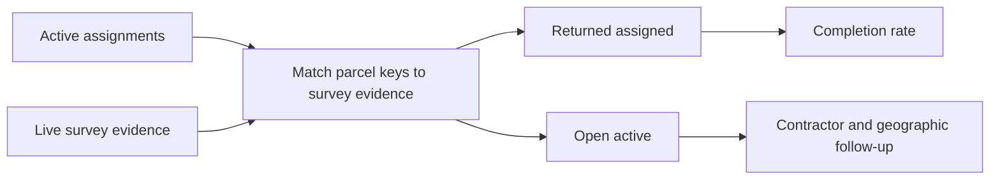
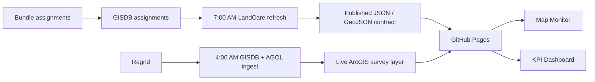

# LandCare Assurance v1.0 presentation script

**Audience:** LandCare program operations, Asset Management, GIS/data operations, finance stakeholders, and leadership.
**Suggested duration:** 15-18 minutes plus discussion.
**Primary demo links:** [Map Monitor](https://rutomo-ura.github.io/land-care-assurance/monitoring/) and [KPI Dashboard](https://rutomo-ura.github.io/land-care-assurance/kpi/).

## Slide 1 - LandCare Assurance is now an operating layer

**On slide**

- v1.0: map monitor, KPI dashboard, daily refresh controls, and executive map brief
- One source-aware view for portfolio performance and follow-up
- Live demo: Map Monitor and KPI Dashboard

**Talk track**

> Today is not a dashboard showcase. It is a handover of an operating layer. v1.0 brings the data, map, metrics, and refresh process together so we can answer three questions quickly: what needs action, where it is, and whether the evidence is current.

## Slide 2 - The problem was not only a low completion number

**On slide**

| Problem | Operational consequence |
|---|---|
| Multiple valid parcel populations | Teams can compare non-comparable counts |
| Survey evidence and assignments arrive through different paths | A missing return can be a data-match issue or a contractor action issue |
| Geographic context is separated from KPI reporting | Supervisors cannot move from an exception to a place |
| Refresh steps need visible controls | A stale report can look current without an explicit freshness signal |

**Talk track**

> A completion percentage alone cannot tell us whether the issue is evidence, assignments, ownership, or contractor delivery. The first design decision was to preserve those distinctions instead of hiding them in one blended metric.

## Slide 3 - v1.0 operating logic

**On slide**

- Active assignments are the completion denominator.
- Request Only is retained as portfolio context, not counted as an Active completion failure.
- Raw survey coverage and assignment-matched returns are shown for different decisions.

**Talk track**

> This is the reasoning at the center of the system. We only call an Active assignment complete when we can match it to evidence. That keeps the completion rate actionable and protects against inflating performance with survey-only records.

## Slide 4 - Data and automation architecture

**Talk track**

> The product is intentionally ArcGIS-first for live evidence and assignment snapshots, while the repository publishes a stable data contract for dashboards and finance. The VM refresh validates its outputs before it publishes data changes.

## Slide 5 - Map Monitor: turn metrics into geographic action

**On slide**

- Filter by period, council district, contractor, and status
- See the current map context and action focus
- Use the same filter state for PDF export

**Demo**

1. Open Map Monitor.
2. Select the latest reporting period.
3. Filter to a contractor or district with open work.
4. Explain that the map is the operational detail behind the KPI queue.

**Talk track**

> The map is not a separate reporting product. It is the drill-down surface for the same operating questions: where is open work concentrated, which contractor owns it, and what survey evidence has returned.

## Slide 6 - KPI Dashboard: read the portfolio before drilling down

**On slide**

- Overview: completion, open queue, inventory, and budget run rate
- Contractor queue: return/open comparison by contractor
- Finance, submission, parcel, and expense tabs use the same decision-first visual hierarchy

**Talk track**

> The KPI page starts with the executive decision: is the portfolio on track, who has the most open work, and what is the financial exposure? The secondary tabs then provide the ledger or ranked analysis needed to act.

## Slide 7 - Executive Map Brief: export only what matters

**On slide**

- Default: completion rate, open active parcels, returned evidence, active scope, annual plan
- Optional: monthly spend, acres, neighborhoods, Request Only, contractor rank
- A3 landscape map, legend, action focus, and source footer

**Demo**

1. In Map Monitor, choose **Export Brief**.
2. Keep the strategic defaults for a leadership brief.
3. Toggle one optional metric to demonstrate customization.
4. Choose **Prepare PDF** and show browser print preview if available.

**Talk track**

> We intentionally avoided exporting every available count. The default brief is designed for decision-making; the checklist preserves flexibility when a supervisor needs more operational context.

## Slide 8 - Current release evidence

**On slide**

| Latest checked-in snapshot | Value |
|---|---:|
| Latest comparable month | 2026-06 |
| Active assigned | 176 |
| Returned assigned | 43 |
| Active completion | 24.4% |
| Open active | 133 |
| Annual finance run rate | $775,000 |

**Talk track**

> These are release-time values, not a promise that the number will remain static. The important capability is that the dashboard exposes data freshness and uses live ArcGIS evidence at runtime. We should use the current dashboard, not this slide, for live operational decisions.

## Slide 9 - Daily operational control

**On slide**

1. Upstream ingestion publishes survey evidence.
2. LandCare refresh rebuilds the data contract.
3. Validator checks dates, counts, duplicates, geometry regressions, and finance data.
4. Status JSON and transcript logs explain a failure by stage.

**Talk track**

> The product is operational only if the refresh is observable. The task scheduler, status JSON, and validation script provide a clear recovery path instead of requiring someone to infer what happened from a stale dashboard.

## Slide 10 - Handover and ownership

**On slide**

| Owner | Commitment |
|---|---|
| GIS/data operations | Keep upstream GISDB and AGOL layers fresh |
| Dashboard owner | Maintain GitHub Pages release and app/data compatibility |
| Finance owner | Maintain budgeting workbook context |
| Program operations | Use open queue and map to drive contractor follow-up |
| Leadership | Confirm denominator and escalation policy decisions |

**Talk track**

> The handover is intentionally role-based. No single person needs to own every component, but every point of failure and decision must have a named operational owner.

## Slide 11 - Definition of ready and next decisions

**On slide**

- Versioned GitHub Pages application and v1.0 release
- Documented data contract, metric logic, runbook, and presentation script
- Map export supports both strategic default and custom KPI selection
- Next: complete VM scheduled-run proof and manual browser print-preview check

**Talk track**

> v1.0 is ready for operational handover: the product, documentation, and validation paths are versioned. The last release checks are environment-specific: prove the VM schedule on the target host and inspect the browser print preview before a meeting where the PDF is shown live.

## Closing prompt

> The decision for the group is not whether to build another report. It is whether we will use this shared operating layer to define ownership, act on open work, and keep the daily evidence pipeline accountable.

## Presenter checklist

- Open both public pages before the meeting.
- Confirm current freshness text and selected reporting period.
- Prepare one contractor or district filter with visible open work for the map demo.
- If showing export, test browser print preview once before the meeting.
- Keep [`v1.0-operational-handover.md`](v1.0-operational-handover.md) available for implementation questions.
