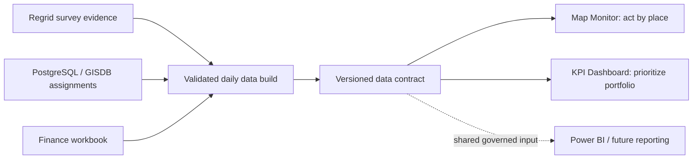
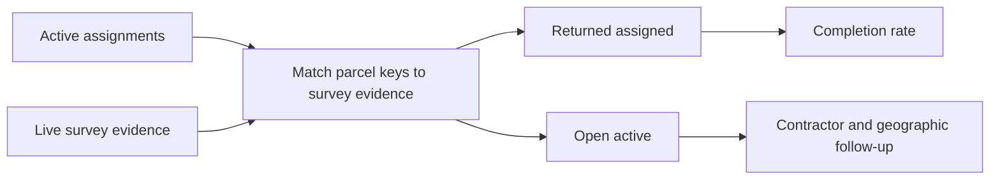
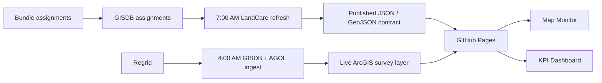

# LandCare Assurance v1.0 presentation script

**Audience:** LandCare program operations, Asset Management, GIS/data operations, finance stakeholders, and leadership.
**Suggested duration:** 15-18 minutes plus discussion.
**Primary demo links:** [Map Monitor](https://rutomo-ura.github.io/land-care-assurance/monitoring/) and [KPI Dashboard](https://rutomo-ura.github.io/land-care-assurance/kpi/).

## Slide 1 - LandCare Assurance is now an operating layer

**On slide**

- v1.0: map monitor, KPI dashboard, daily refresh controls, and executive map brief
- One source-aware view for portfolio performance and follow-up
- Live demo: Map Monitor and KPI Dashboard

**Talk track**

> Today is not a dashboard showcase. It is a handover of an operating layer. v1.0 brings the data, map, metrics, and refresh process together so we can answer three questions quickly: what needs action, where it is, and whether the evidence is current.

## Slide 2 - Before v1.0: valid systems, fragmented operating work

**On slide**

| Existing asset | Prior presentation or operating role | Friction for a supervisor |
|---|---|---|
| Regrid | Field-survey collection and source evidence | Evidence was not, by itself, an accountable active-assignment queue |
| PostgreSQL / GISDB | Operational storage and technical data pull | Answering a management question required a technical export or transformation |
| Spreadsheet / finance workbook | Budget, contract, and plan context | Finance context had to be manually reconciled into a reporting view |
| Previous Power BI | Summary reporting | Geographic action, current evidence, and the follow-up queue were not owned in one operating surface |

**Talk track**

> This is not a replacement story. Regrid, PostgreSQL, the finance workbook, and Power BI each solve a legitimate problem. The gap was the handoff between them: people had to translate source evidence, assignment scope, finance context, and a map into one decision. That made routine follow-up more manual than it needed to be.

## Slide 3 - What v1.0 keeps, standardizes, and adds

**On slide**

| System | Role in the v1.0 operating model | What changes for the user |
|---|---|---|
| Regrid | Retained as upstream survey evidence | Evidence is matched to active assignments before it becomes completion performance |
| PostgreSQL / GISDB | Retained as authoritative operational store | Repeatable refresh uses its assignment data; dashboards do not depend on ad hoc presentation pulls |
| Spreadsheet / finance workbook | Retained as finance source context | Published finance summary gives the app a consistent, traceable view |
| Power BI | Retained as a reporting consumer where needed | Future reporting should use the same governed data contract, not recreate manual logic |
| LandCare Assurance v1.0 | New operating layer | Map action, KPI readout, data freshness, and exportable brief are connected in one product |

**Talk track**

> v1.0 keeps the systems of record in their strengths. It standardizes the transformations between them, then adds the missing decision surface: a map for action, KPIs for prioritization, visible freshness, and a brief for leadership. The goal is fewer manual handoffs, not a risky replacement of the underlying systems.

## Slide 4 - The problem was not only a low completion number

**On slide**

| Problem | Operational consequence |
|---|---|
| Multiple valid parcel populations | Teams can compare non-comparable counts |
| Survey evidence and assignments arrive through different paths | A missing return can be a data-match issue or a contractor action issue |
| Geographic context is separated from KPI reporting | Supervisors cannot move from an exception to a place |
| Refresh steps need visible controls | A stale report can look current without an explicit freshness signal |

**Talk track**

> A completion percentage alone cannot tell us whether the issue is evidence, assignments, ownership, or contractor delivery. The first design decision was to preserve those distinctions instead of hiding them in one blended metric.

## Slide 5 - v1.0 operating logic

**On slide**

- Active assignments are the completion denominator.
- Request Only is retained as portfolio context, not counted as an Active completion failure.
- Raw survey coverage and assignment-matched returns are shown for different decisions.

**Talk track**

> This is the reasoning at the center of the system. We only call an Active assignment complete when we can match it to evidence. That keeps the completion rate actionable and protects against inflating performance with survey-only records.

## Slide 6 - Data and automation architecture

**Talk track**

> The product is intentionally ArcGIS-first for live evidence and assignment snapshots, while the repository publishes a stable data contract for dashboards and finance. The VM refresh validates its outputs before it publishes data changes.

## Slide 7 - Map Monitor: turn metrics into geographic action

**On slide**

- Filter by period, council district, contractor, and status
- See the current map context and action focus
- Use the same filter state for PDF export

**Demo**

1. Open Map Monitor.
2. Select the latest reporting period.
3. Filter to a contractor or district with open work.
4. Explain that the map is the operational detail behind the KPI queue.

**Talk track**

> The map is not a separate reporting product. It is the drill-down surface for the same operating questions: where is open work concentrated, which contractor owns it, and what survey evidence has returned.

## Slide 8 - KPI Dashboard: read the portfolio before drilling down

**On slide**

- Overview: completion, open queue, inventory, and budget run rate
- Contractor queue: return/open comparison by contractor
- Finance, submission, parcel, and expense tabs use the same decision-first visual hierarchy

**Talk track**

> The KPI page starts with the executive decision: is the portfolio on track, who has the most open work, and what is the financial exposure? The secondary tabs then provide the ledger or ranked analysis needed to act.

## Slide 9 - Executive Map Brief: export only what matters

**On slide**

- Default: completion rate, open active parcels, returned evidence, active scope, annual plan
- Optional: monthly spend, acres, neighborhoods, Request Only, contractor rank
- A3 landscape map, legend, action focus, and source footer

**Demo**

1. In Map Monitor, choose **Export Brief**.
2. Keep the strategic defaults for a leadership brief.
3. Toggle one optional metric to demonstrate customization.
4. Choose **Prepare PDF** and show browser print preview if available.

**Talk track**

> We intentionally avoided exporting every available count. The default brief is designed for decision-making; the checklist preserves flexibility when a supervisor needs more operational context.

## Slide 10 - Current release evidence

**On slide**

| Latest checked-in snapshot | Value |
|---|---:|
| Latest comparable month | 2026-06 |
| Active assigned | 176 |
| Returned assigned | 43 |
| Active completion | 24.4% |
| Open active | 133 |
| Annual finance run rate | $775,000 |

**Talk track**

> These are release-time values, not a promise that the number will remain static. The important capability is that the dashboard exposes data freshness and uses live ArcGIS evidence at runtime. We should use the current dashboard, not this slide, for live operational decisions.

## Slide 11 - Daily operational control

**On slide**

1. Upstream ingestion publishes survey evidence.
2. LandCare refresh rebuilds the data contract.
3. Validator checks dates, counts, duplicates, geometry regressions, and finance data.
4. Status JSON and transcript logs explain a failure by stage.

**Talk track**

> The product is operational only if the refresh is observable. The task scheduler, status JSON, and validation script provide a clear recovery path instead of requiring someone to infer what happened from a stale dashboard.

## Slide 12 - Handover and ownership

**On slide**

| Owner | Commitment |
|---|---|
| GIS/data operations | Keep upstream GISDB and AGOL layers fresh |
| Dashboard owner | Maintain GitHub Pages release and app/data compatibility |
| Finance owner | Maintain budgeting workbook context |
| Program operations | Use open queue and map to drive contractor follow-up |
| Leadership | Confirm denominator and escalation policy decisions |

**Talk track**

> The handover is intentionally role-based. No single person needs to own every component, but every point of failure and decision must have a named operational owner.

## Slide 13 - Design system: build an executive BI product, not a generic dashboard

**On slide**

- Decision first: one dominant portfolio signal, then the driver, then the action list
- Editorial hierarchy: a calm masthead, slim context row, metric band, analysis workspace, and ledger
- Color is semantic: blue for primary information, green for target/success, amber for caution, red/orange for open risk
- Every number carries context: period, denominator, comparison, or source/freshness note

**Talk track**

> The design standard is deliberately more like a focused operating brief than a collection of widgets. A user should know the decision, its scale, the driver, and the next action without reading a wall of labels. Visual polish is useful only when it makes that sequence faster.

## Slide 14 - Definition of ready and next decisions

**On slide**

- Versioned GitHub Pages application and v1.0 release
- Documented data contract, metric logic, runbook, and presentation script
- Map export supports both strategic default and custom KPI selection
- Daily refresh evidence is auditable in the data commit history; presenter preflight remains a browser print-preview check

**Talk track**

> v1.0 is ready for operational handover: the product, documentation, validation paths, and daily refresh evidence are versioned. Before any meeting where a PDF is shown live, simply inspect the browser print preview once with the selected map filters.

## Closing prompt

> The decision for the group is not whether to build another report. It is whether we will use this shared operating layer to define ownership, act on open work, and keep the daily evidence pipeline accountable.

## Presenter checklist

- Open both public pages before the meeting.
- Confirm current freshness text and selected reporting period.
- Prepare one contractor or district filter with visible open work for the map demo.
- If showing export, test browser print preview once before the meeting.
- Keep [`v1.0-operational-handover.md`](v1.0-operational-handover.md) available for implementation questions.

## Design-system handoff for the next agent

Use this section as the build brief whenever extending LandCare or applying the visual system to another operational BI product.

### Product intent

Build a confident, quiet business-intelligence operating surface. It should feel like a well-edited executive brief with interactive detail behind it—not a marketing site, a generic card gallery, or a dense analyst workbench. The interface must lead a manager from **portfolio signal** to **driver** to **action** in one scan.

### Canonical implementation references

- [`design-system/README.md`](design-system/README.md): principles, component anatomy, content rules, responsive and accessibility requirements.
- [`design-system/executive-bi.css`](design-system/executive-bi.css): reusable scoped CSS tokens and components. Apply the `.bi-dashboard` scope before using its classes.
- [`design-system/example.html`](design-system/example.html): visual reference implementation.
- [`landcare/app.css`](landcare/app.css), [`landcare/monitoring.js`](landcare/monitoring.js), and [`landcare/kpi.js`](landcare/kpi.js): the production expression of the system.

### Non-negotiable visual rules

| Area | Build rule |
|---|---|
| Hierarchy | Use a masthead, context line, section introduction, metric band, primary analysis workspace, then data ledger. Do not make every element a same-weight card. |
| Primary decision | Give each screen one dominant metric or action focus. Supporting metrics explain it; they do not compete with it. |
| Typography | Use short, factual labels; large tabular numerals for key values; restrained helper text for denominator, source, or freshness. Avoid paragraph-heavy cards. |
| Color | Primary `#006c9f`; deep ink `#00334f`; accent `#0098d3`; soft blue `#e8f6fc`; success/target `#2e7d32`; open-risk `#c2410c`. Never use color as the only status signal. |
| Cards | Prefer a few purpose-built panels with generous internal spacing, subtle borders, and low-elevation shadows. Avoid rounded, icon-heavy template cards. |
| Charts | One analytical job per chart. Show direct labels or a concise legend, clear targets/benchmarks, and enough whitespace to compare values. |
| Tables / queues | Treat them as operational ledgers: strong row labels, meaningful sort/order, compact metadata, and visible status. Keep a clear next-action relationship to the chart or map above. |
| Maps | Pair spatial context with an action focus, readable legend, filter state, and a structured detail panel. A map alone is not an operational decision surface. |
| Export | Produce an A3 landscape executive brief with headline metrics, action focus, map/legend, source and freshness footer. Default to strategic metrics; expose optional measures through a labelled checklist. |

### Required screen anatomy

1. **Masthead:** product name, concise purpose, primary navigation, and freshness/status—no hero illustration.
2. **Context row:** selected period and filters; show active scope plainly.
3. **Section intro:** a clear question or decision, followed by one sentence that explains why it matters.
4. **Metric band:** three to five decision metrics, each with a value and a compact explanation of its definition or change.
5. **Analysis workspace:** the dominant chart, map, ranking, or exception queue; controls should be adjacent, not scattered.
6. **Operational ledger:** sortable/detail table or queue for users ready to act.
7. **Provenance:** visible source, freshness, denominator, and export timestamp where relevant.

### Interaction, responsive, and accessibility requirements

- Keep filters persistent and reflect their state in headings, exports, and summaries.
- Let a user move from a KPI/queue to geographic or record-level detail without re-entering context.
- Use text and/or icons alongside status color; maintain keyboard focus, labelled controls, and usable contrast.
- On smaller screens, stack the metric band and analysis panels while preserving the priority order. Never hide essential definition or freshness information merely to make the layout fit.
- Loading, empty, stale, and error states must explain the implication and next step, not just show a spinner or generic failure message.

### Acceptance check before handoff

- Can a manager identify the top decision within five seconds?
- Does every headline metric state its scope, denominator, comparison, or freshness context?
- Are risk, target, and neutral information visually distinct without relying only on color?
- Does each chart/map lead to a named action queue, drill-down, or next step?
- Does the export preserve the same decision hierarchy as the screen?
- Does the screen look purposeful and editorial rather than like an off-the-shelf dashboard template?

### Agent-ready build prompt

> Build **[screen name]** using the LandCare Executive BI design system. Start with the manager's decision: **[decision]**. Use the required anatomy—masthead, filter/context row, section intro, metric band, one primary analysis workspace, and an operational ledger. Apply the scoped tokens from `docs/design-system/executive-bi.css`; preserve the semantic status colors and visible provenance. Keep copy concise and factual. Avoid generic icon-card grids, decorative gradients, and equal-weight widgets. Make filters persist into the screen summary and export. Validate keyboard access, contrast, responsive stacking, empty/error states, and the five-second decision test.
