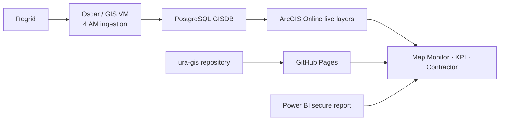

# LandCare Handover Readiness Checklist

Status date: August 6, 2026

This is the current handover entry point. It separates what is operating now from work the successor must finish.

## Current operating model

- Live assignments, surveys, comments, field notes, and completion counts are queried from ArcGIS at page load.
- GitHub Pages serves the application. Checked-in JSON and GeoJSON are compatibility fallback files, not the current data source.
- Land Care Budget and Parcel Area are secure Power BI embeds.
- The separate 7 AM dashboard refresh is deprecated and is not part of the current production flow.

## Delivered and ready

- [x] Repository and Pages are under [`ura-gis/land-care-assurance`](https://github.com/ura-gis/land-care-assurance), branch `master`.
- [x] [Map Monitor](https://ura-gis.github.io/land-care-assurance/monitoring/), [KPI](https://ura-gis.github.io/land-care-assurance/kpi/), [contractor portal](https://ura-gis.github.io/land-care-assurance/contractor/), and [survey submission](https://ura-gis.github.io/land-care-assurance/survey-submission/) are published.
- [x] Survey evidence uses ArcGIS item [`7a2e1d9bacba461296c54a63f104cf51`](https://urap.maps.arcgis.com/home/item.html?id=7a2e1d9bacba461296c54a63f104cf51) through the shared [`survey-layer.js`](../docs/landcare/survey-layer.js).
- [x] Assignment history and current-period data use the shared [`assignment-layer.js`](../docs/landcare/assignment-layer.js).
- [x] `additional_comments` is normalized to `additional_notes`; Map Monitor shows comments and filtered Field Notes with contractor colors.
- [x] Completion uses raw assignment-matched survey records divided by Active assignments. Request Only is excluded from the denominator.
- [x] Land Care Budget and Parcel Area use the authenticated Power BI report instead of copied visual values.
- [x] The framework-free [design system](../docs/design-system/README.md) and [runnable example](https://ura-gis.github.io/land-care-assurance/design-system/example.html) are available for another web application.
- [x] Operational references exist as [DOCX](../docs/LandCare-Operational-Handover.docx), [PDF](../output/pdf/LandCare-PM-Handover.pdf), and [presentation](03-presentation.pptx).

## 7 AM job decision

Evidence in this repository shows automatic `Refresh LandCare dashboard data` commits through July 28, 2026. The checked-in static GIS contract was last generated July 29, while the live ArcGIS layers contain newer data. The scheduled task and its VM logs are not present on this computer.

Decision: `LandCare-Daily-Dashboard-Refresh.task` is deprecated. Current pages must not depend on it for live assignments, surveys, comments, field notes, or completion.

Successor retirement steps on the GIS VM:

- [ ] Export the scheduled-task definition and retain the latest status JSON and transcript logs.
- [ ] Record its last run, result code, principal, trigger, and command.
- [ ] Confirm the 4 AM Regrid/Oscar pipeline still updates all three live ArcGIS layers.
- [ ] Disable the 7 AM task. Do not delete it on the first day.
- [ ] Open all four Pages routes after the next 4 AM cycle and confirm current period, counts, comments, images, and Power BI embeds.
- [ ] After two business days without regression, remove the deprecated task or retain it disabled under the organization’s normal retention policy.

The legacy scripts under [`scripts/`](../scripts/) remain recovery references. Reactivation requires a documented consumer, an organization automation account, read-only PostgreSQL credentials, a repository deploy key, fresh validation, and a checked run. Do not reactivate it under a departing user account.

## Successor work

### Administration and security

- [ ] Enable branch protection for `master` and require the Pages validation check.
- [ ] Configure repository variables for the morning-brief assignee and recipients, then prove dry-run and live delivery.
- [ ] Remove the departing user from GitHub and VM access after owner sign-off.
- [ ] Confirm at least two GitHub organization owners and 2FA coverage.
- [ ] Complete ArcGIS Online Change Owner actions and verify dashboard/Experience Builder embeds use the `ura-gis` Pages URLs.

### Product and data

- [ ] Keep Power BI as the source for Land Care Budget and Parcel Area. Complete service-principal aggregate extraction only if native public KPI finance cards are still required. See the [Power BI source guide](../docs/powerbi-landcare-finance-source.md).
- [ ] Decide whether to deploy the governed Survey123 approval and evidence pipeline. Until then, Regrid evidence remains the completion source. See the [Survey123 setup](../docs/survey123-landcare-network-setup.md).
- [ ] Add `pytest` to the development/CI test environment and run the Python suite in GitHub Actions.
- [ ] Refresh dated PDF, DOCX, and presentation artifacts only when they are reused; current Markdown documentation is authoritative.

## Daily check

1. Open Map Monitor and confirm the latest ArcGIS assignment and survey periods.
2. Compare the selected-period completion count between Map Monitor and KPI.
3. Open one Field Note and confirm its parcel, contractor pill, comment, date, and image.
4. Open Land Care Budget and Parcel Area and confirm the secure Power BI report loads.
5. Check the latest GitHub Pages deployment if application code changed.

## Safe change and rollback

Read [`AGENTS.md`](../AGENTS.md), [`HANDOVER.md`](../HANDOVER.md), the [architecture](../docs/landcare-architecture.md), and the [metrics contract](../docs/landcare-metrics-context.md) before editing. Run the Python tests, [`survey-layer.test.mjs`](../tests/survey-layer.test.mjs), Pages validation, and the live ArcGIS smoke test before pushing.

For rollback, revert the focused application commit on `master` and redeploy Pages. Do not change ArcGIS schemas, endpoints, or data to roll back a browser-only defect.

## Day 0 sign-off

- [ ] Successor can clone, branch, test, push, and deploy a documentation change.
- [ ] All public routes and secure Power BI embeds open.
- [ ] ArcGIS item ownership and embeds have named owners.
- [ ] Deprecated 7 AM task evidence is archived and the task is disabled.
- [ ] No password, PAT, private key, browser session, or secret value exists in Git or the handover files.

## Day +2 sign-off

- [ ] Two 4 AM ArcGIS update cycles completed with current layer timestamps.
- [ ] Pages still reports current assignment and survey periods without the 7 AM task.
- [ ] Morning brief and repository governance have an operational owner.
- [ ] Departing-user access and obsolete credentials are removed.
- [ ] Remaining Survey123 and optional Power BI extraction work has an owner and target date.
