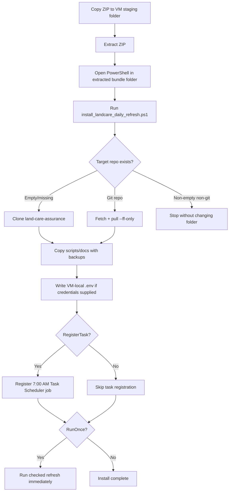
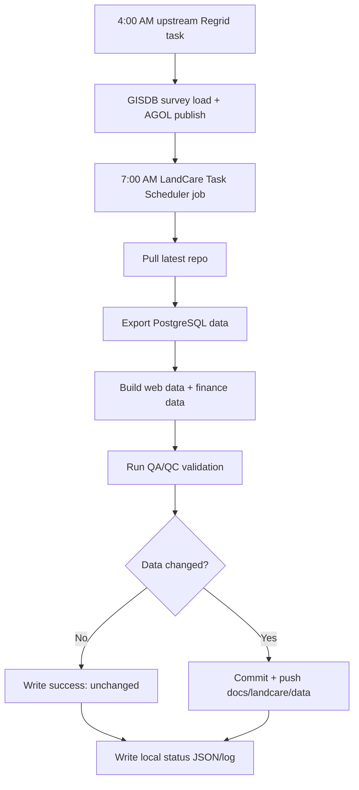

# LandCare Task Scheduler VM Bundle

This bundle bootstraps or updates the LandCare dashboard repo on the VM and optionally registers the 7:00 AM Windows Task Scheduler refresh job.

Power Automate is not required. The active operating model is Task Scheduler plus local logs/status JSON.

## Bundle Contents

- `install_landcare_daily_refresh.ps1`
- `scripts\refresh_landcare_dashboard.ps1`
- `scripts\validate_landcare_daily_refresh.py`
- `scripts\register_landcare_daily_refresh_task.ps1`
- `docs\task-scheduler-vm-operations.md`
- `docs\landcare-architecture.md`
- `docs\landcare-data-engineering-flow.md`
- `docs\landcare-production-data-engineering-plan.md`
- `docs\upstream-regrid-survey-pipeline.md`
- `docs\vm-smoke-test-regrid-daily-sync.md`
- `data engineering\current-data-qaqc-source-inventory.md`
- `data engineering\platform-architecture-esri-codex-power-platform.md`

## Install Flow



## Daily Task Scheduler Flow



## Install

Copy this extracted folder to the VM, then run PowerShell from the bundle folder. `C:\srv\GISWebApp` is the umbrella folder; LandCare lives one folder below it.

```powershell
.\install_landcare_daily_refresh.ps1 -TargetRepoRoot C:\srv\GISWebApp\land-care-assurance
```

## Install With VM-Local Database Settings

The bundle does not contain a database password. Supply the VM-local values
through a secure prompt when writing `.env`:

```text
PG_HOST=10.0.101.57
PG_PORT=5432
PG_DB=gisdb
PG_USER=rutomo
```

To prompt for the PostgreSQL password instead:

```powershell
.\install_landcare_daily_refresh.ps1 `
  -TargetRepoRoot C:\srv\GISWebApp\land-care-assurance `
  -PgHost 10.0.101.57 `
  -PgPort 5432 `
  -PgDb gisdb `
  -PgUser rutomo `
  -PgPassword "" `
  -PromptForPgPassword
```

## Register Task Scheduler

```powershell
.\install_landcare_daily_refresh.ps1 `
  -TargetRepoRoot C:\srv\GISWebApp\land-care-assurance `
  -RegisterTask
```

Install, register, and immediately run one checked refresh:

```powershell
.\install_landcare_daily_refresh.ps1 `
  -TargetRepoRoot C:\srv\GISWebApp\land-care-assurance `
  -RegisterTask `
  -RunOnce
```

## Manual Refresh

```powershell
cd C:\srv\GISWebApp\land-care-assurance
.\scripts\refresh_landcare_dashboard.ps1 -RepoRoot C:\srv\GISWebApp\land-care-assurance
```

## Logs

```text
C:\srv\logs\land-care-assurance\daily-refresh-YYYY-MM-DD.log
C:\srv\logs\land-care-assurance\daily-refresh-status.json
C:\srv\logs\land-care-assurance\daily-refresh-status-YYYY-MM-DD.json
```

## Upstream Regrid Dependency

The LandCare 7:00 AM refresh assumes the upstream Regrid task has already run at 4:00 AM from:

```text
C:\srv\URA-Data-Repository
```

See `docs\task-scheduler-vm-operations.md` after install for the full mermaid-documented operating flow.
