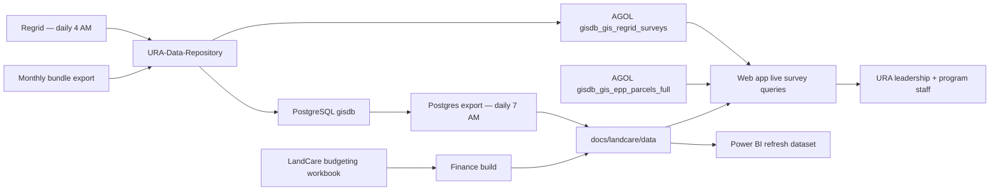

# LandCare Monitoring Production Data Engineering Plan

See [`docs/landcare-architecture.md`](landcare-architecture.md) for the canonical platform architecture.

## Current State

The LandCare monitoring site has two production-facing views:

- `docs/monitoring/index.html`: map monitor for current URA-owned LandCare parcels, council district focus, contractor filter, status legend, and action focus.
- `docs/kpi/index.html`: KPI dashboard with current universe, latest survey completion, contractor performance, budget, check request history, parcel area, parcel detail, and maintenance expense tabs.

**Runtime data model (2026-07):**

- **Returned surveys:** live ArcGIS Online [`gisdb_gis_regrid_surveys`](https://urap.maps.arcgis.com/home/item.html?id=a4012693d5d74dd8998610c4d235068d), queried at page load via `docs/landcare/survey-layer.js`.
- **Current parcel universe:** live AGOL `gisdb_gis_epp_parcels_full`.
- **Assignment denominators and finance:** published JSON/GeoJSON under `docs/landcare/data`, rebuilt daily at 7:00 AM from PostgreSQL and the budgeting workbook.

Upstream surveys ingest daily at 4:00 AM into GISDB and AGOL. Bundle assignments still load monthly on the 15th.

## Target Architecture



## What Is In Place

1. **VM refresh environment** — Python venv, `.env` credentials, Task Scheduler at 7:00 AM Eastern.

2. **Daily Postgres-to-web exports** — `export_landcare_postgres_data.py` + `build_landcare_web_data.py` publish assignment and metric JSON/GeoJSON.

3. **Finance in the same refresh cycle** — `build_landcare_finance_data.py` from the LandCare budgeting workbook.

4. **Upstream daily Regrid pipeline** — `regrid_survey_daily_pipeline.py` at 4:00 AM in `URA-Data-Repository` loads GISDB and publishes AGOL survey layer.

5. **Live survey layer in web app** — `survey-layer.js`, `monitoring.js`, and `kpi.js` query AGOL for returned survey evidence at page load.

6. **QA and monitoring hooks** - `validate_landcare_daily_refresh.py`, `daily-refresh-status.json`, transcript logs, and Task Scheduler history.

## What Still Needs To Be Built

1. **Power BI consumption contract** — align semantic model with published JSON and live AGOL survey layer for latest-month returned counts.

2. **Task Scheduler monitoring discipline** - review Task Scheduler history and `C:\srv\logs\land-care-assurance\daily-refresh-status.json` after failures or stale dashboard reports.

3. **GitHub Actions smoke checks** — JavaScript syntax and JSON validity before Pages deploy.

## VM Setup

Recommended folder layout:

```powershell
C:\srv\GISWebApp
C:\srv\GISWebApp\land-care-assurance
C:\srv\GISWebApp\land-care-assurance\.venv
C:\srv\logs\land-care-assurance
```

One-time setup:

```powershell
cd C:\srv\GISWebApp
git clone https://github.com/ura-gis/land-care-assurance.git
cd C:\srv\GISWebApp\land-care-assurance
py -3.12 -m venv .venv
.\.venv\Scripts\python -m pip install -r requirements-landcare-refresh.txt
```

Create `C:\srv\GISWebApp\land-care-assurance\.env` on the VM:

```powershell
PG_HOST=10.0.101.57
PG_PORT=5432
PG_DB=gisdb
PG_USER=rutomo
PG_PASSWORD=<store-on-vm-only>
```

Manual refresh command:

```powershell
cd C:\srv\GISWebApp\land-care-assurance
.\scripts\refresh_landcare_dashboard.ps1 -RepoRoot C:\srv\GISWebApp\land-care-assurance
```

## Upstream Regrid VM Update

The dashboard refresh depends on the upstream Regrid flow in `URA-GIS-User/URA-Data-Repository`. Update and verify that repo before relying on the daily dashboard refresh.

```powershell
cd C:\srv\URA-Data-Repository
git pull --ff-only origin main
psql -h localhost -U postgres -d gisdb -f sql\regrid_survey_pipeline_migration.sql
C:\ProgramData\ESRI\conda\envs\arcgispro-py3-clone\python.exe .\regrid_survey_daily_pipeline.py
```

Expected upstream outputs:

| Output | Expected state |
|---|---|
| `gis.regrid_survey_submissions` | Raw survey rows loaded daily; duplicate prevention is `period + parcelnumb + created_at + image_original` |
| `gis.regrid_surveys` | AGOL-facing polygon view joined to `gis.pgh_parcels` geometry |
| `gis.regrid_survey_unmatched_parcels` | QA view for submissions without parcel geometry |
| AGOL `gisdb_gis_regrid_surveys` | Existing hosted item `a4012693d5d74dd8998610c4d235068d` overwritten, not duplicated |

Task Scheduler should show:

| Task | Folder | Schedule |
|---|---|---|
| Regrid daily survey pipeline | `\GIS Automations\REGRID` | Daily 4:00 AM Eastern |
| Regrid monthly CSV archive | `\GIS Automations\REGRID` | 15th of month, 4:15 AM Eastern |
| LandCare dashboard refresh | `\GIS Automations` | Daily 7:00 AM Eastern |

## Refresh Schedule

- **Daily 7:00 AM Eastern:** full dashboard refresh via `refresh_landcare_dashboard.ps1`, after upstream Regrid survey pipeline at 4:00 AM.
- **Monthly 15th:** bundle assignment denominator updates upstream; dashboard refresh picks up new assignment period once comparable survey data exists.
- **After contract updates:** run finance refresh immediately so budget and maintenance tabs stay aligned.

Recommended Task Scheduler cadence:

- LandCare dashboard refresh: **every day, 7:00 AM Eastern** under `\GIS Automations`.
- Upstream Regrid survey pipeline: **every day, 4:00 AM Eastern** under `\GIS Automations\REGRID` (see `docs/upstream-regrid-survey-pipeline.md`).

## Data Quality Checks

The refresh should fail loudly when:

- PostgreSQL connection fails.
- No URA-owned LandCare records are exported.
- Latest survey month moves backward.
- Latest assignment month moves backward.
- `survey_submission_count` or `returned_assigned` decreases within the same period/month compared with the prior run.
- The generated JSON files are missing or invalid.

## Next Improvements

- Add district-level completion rollups to the KPI dashboard.
- Add contractor SLA thresholds for red/yellow/green completion status.
- Add a Power BI dataflow or semantic model that reads the same dashboard JSON contract.
- Move finance workbook ingestion fully behind PostgreSQL once parcel count and acreage fields are available in `gis.land_care_budgeting_contracts`.
- Add GitHub Actions smoke checks for JavaScript syntax and JSON validity before publishing.
